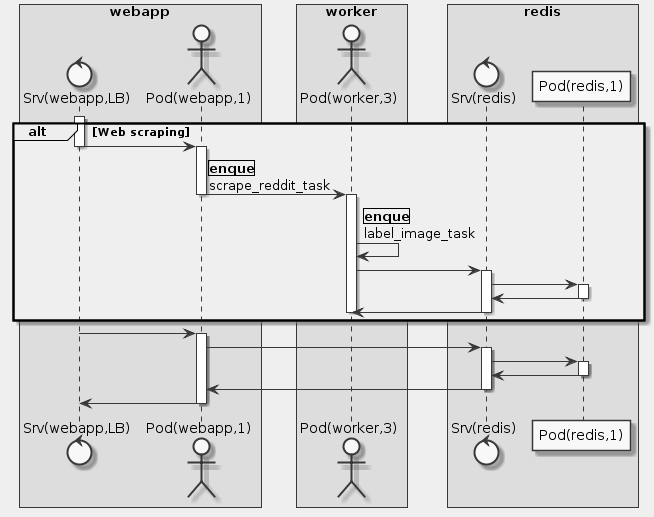

# Goal
- A simple Redis instance
- A web app that displays the labels and associated images
- A worker that handles scraping Reddit for images and classifying them using the Vision API. Cloud Pub/Sub is used to coordinate tasks between multiple worker instances

# Task
- [x] Create a Kubernetes Engine cluster
- [x] Get the Sample
- [x] Deploy the sample
- [x] Check the Kubernetes resources on the cluster
- [x] Visit your new web app and start its crawler

# Supplement


```uml
skinparam monochrome true
skinparam backgroundColor #EEEEFF

box webapp
    control "Srv(webapp,LB)" as AS
    actor "Pod(webapp,1)" as AP
end box

box worker
    actor "Pod(worker,3)" as W
end box

box redis
    control "Srv(redis)" as RS
    participant "Pod(redis,1)" as RP
end box

alt Web scraping
    activate AS
    AS -> AP
    deactivate AS
    activate AP
    AP -> W: |enque|\nscrape_reddit_task
    deactivate AP
    activate W
    W -> W: |enque|\nlabel_image_task
    W -> RS
    activate RS
    RS -> RP
    activate RP
    RP -> RS
    deactivate RP
    RS -> W
    deactivate RS
    deactivate W
end

activate AS
AS -> AP
activate AP
AP -> RS
activate RS
RS -> RP
activate RP
RP -> RS
deactivate RP
RS -> AP
deactivate RS
AP -> AS
deactivate AP
deactivate AS
```

## Create a Kubernetes Engine cluster
```sh
gcloud config set compute/zone us-central1-a
gcloud config set project qwiklabs-gcp-42bba603eba66a4a
gcloud container clusters create awwvision --num-nodes 2 --scopes cloud-platform
gcloud container clusters get-credentials awwvision
kubectl cluster-info
```

## Get the Sample
```sh
git clone https://github.com/GoogleCloudPlatform/cloud-vision
```

## Deploy the sample
```sh
cd cloud-vision/python/awwvision
make all

kubectl get pods
kubectl get deployments -o wide
kubectl get svc awwvision-webapp
```

## Reference
- https://github.com/GoogleCloudPlatform/cloud-vision/tree/master/python/awwvision
