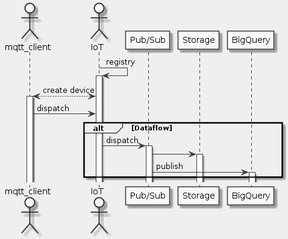

# Goal
- Connect and manage MQTT-based devices using Cloud IoT Core (we will use simulated devices.)
- Ingest a stream of information from Cloud IoT Core using Cloud Pub/Sub.
- Process the IoT data using Cloud Dataflow.
- Analyze the IoT data using BigQuery.

# Task
- [x] Create a Cloud Pub/Sub topic
- [x] Create a BigQuery dataset
- [x] Create a cloud storage bucket
- [x] Set up a Cloud Dataflow Pipeline
- [x] Prepare your compute engine VM
- [x] Create a registry for IoT devices
- [x] Create a Cryptographic Keypair
- [x] Add simulated devices to the registry
- [x] Run simulated devices
- [x] Analyze the Sensor Data Using BigQuery

# Supplement


```uml
skinparam monochrome true
skinparam backgroundColor #EEEEFF

actor mqtt_client as MQ
actor IoT as I
participant "Pub/Sub" as PS
participant Storage as S
participant BigQuery as BQ

I -> I: registry
activate I
MQ <--> I: create device
MQ -> I: dispatch

alt Dataflow
  I -> PS: dispatch
  activate PS
  PS -> S
  activate S
  PS -> BQ: publish
  activate BQ
end
```

## Prepare your compute engine VM
```sh
sudo apt-get remove google-cloud-sdk -y
curl https://sdk.cloud.google.com | bash
exec -l bash
gcloud init
gcloud components update
gcloud components install beta
sudo apt-get update
sudo apt-get install python-pip openssl git -y
sudo pip install pyjwt paho-mqtt cryptography
git clone http://github.com/GoogleCloudPlatform/training-data-analyst
```

## Create a registry for IoT devices
```sh
export PROJECT_ID=qwiklabs-gcp-be2499e9391d87a7
export MY_REGION=us-central1
gcloud beta iot registries create iotlab-registry \
   --project=$PROJECT_ID \
   --region=$MY_REGION \
   --event-notification-config=topic=projects/$PROJECT_ID/topics/iotlab
```

### Create a Cryptographic Keypair
```sh
cd $HOME/training-data-analyst/quests/iotlab/
openssl req -x509 -newkey rsa:2048 -keyout rsa_private.pem \
    -nodes -out rsa_cert.pem -subj "/CN=unused"

gcloud beta iot devices create temp-sensor-buenos-aires \
  --project=$PROJECT_ID \
  --region=$MY_REGION \
  --registry=iotlab-registry \
  --public-key path=rsa_cert.pem,type=rs256

gcloud beta iot devices create temp-sensor-istanbul \
  --project=$PROJECT_ID \
  --region=$MY_REGION \
  --registry=iotlab-registry \
  --public-key path=rsa_cert.pem,type=rs256
```

## Run simulated devices
```sh
cd $HOME/training-data-analyst/quests/iotlab/
wget https://pki.google.com/roots.pem

python cloudiot_mqtt_example_json.py \
   --project_id=$PROJECT_ID \
   --cloud_region=$MY_REGION \
   --registry_id=iotlab-registry \
   --device_id=temp-sensor-buenos-aires \
   --private_key_file=rsa_private.pem \
   --message_type=event \
   --algorithm=RS256 > buenos-aires-log.txt 2>&1 &

python cloudiot_mqtt_example_json.py \
   --project_id=$PROJECT_ID \
   --cloud_region=$MY_REGION \
   --registry_id=iotlab-registry \
   --device_id=temp-sensor-istanbul \
   --private_key_file=rsa_private.pem \
   --message_type=event \
   --algorithm=RS256
```

## Analyze the Sensor Data Using BigQuery
```sql
SELECT timestamp, device, temperature
FROM iotlabdataset.sensordata
ORDER BY timestamp DESC
LIMIT 100
```

## Refernce
http://github.com/GoogleCloudPlatform/training-data-analyst