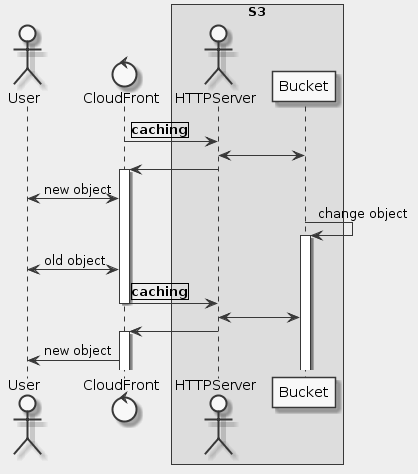

# Goal
- Create and configure an Amazon CloudFront web distribution
- Update and invalidate your content on Amazon CloudFront
- Test your content from both Amazon S3 and Amazon CloudFront

# Task
- [x] Verify Your Lab Environment
- [x] Create an Amazon CloudFront Web Distribution
- [x] Test Your Static Website from an Amazon CloudFront Distribution
- [x] Test Your Full Site Hosting
- [x] Update Your Site: Cached Content Considerations
- [x] Invalidate Your Cache

# Supplement


```uml
skinparam monochrome true
skinparam backgroundColor #EEEEEE

actor User as U
control CloudFront as CFt
box S3
    actor HTTPServer as N
    participant Bucket as B
end box

CFt -> N: |caching|
N <-> B
N -> CFt:
activate CFt
CFt <-> U: new object

B -> B: change object
activate B

U <-> CFt: old object

CFt -> N: |caching|
deactivate CFt
N <-> B
N -> CFt
activate CFt
CFt -> U: new object
```

## Verify Your Lab Environment
https://qls-9065329-ae918265ced13452-s3bucket-oh9aqgm1p8i8.s3.amazonaws.com/cf_lab1.html

## Create an Amazon CloudFront Web Distribution
d2w7g7xo81o5n2.cloudfront.net

## Test Your Static Website from an Amazon CloudFront Distribution
```sh
CF_NAME=d2w7g7xo81o5n2.cloudfront.net

cat <<EOF >caching_static_files_with_amazon_cloudfront___cf_lab1_test.html
<html>
<head>My CloudFront Test</head>
<body>
<p>My text content goes here.</p>
<p> 
</body>
</html>
EOF
```

## Test Your Full Site Hosting
http://d2w7g7xo81o5n2.cloudfront.net/cf_lab1.html

## Reference
- https://aws.amazon.com/cloudfront/
- https://docs.aws.amazon.com/AmazonCloudFront/latest/DeveloperGuide/Introduction.html
- https://docs.aws.amazon.com/AmazonCloudFront/latest/DeveloperGuide/GettingStarted.html
- https://docs.aws.amazon.com/AmazonCloudFront/latest/DeveloperGuide/Expiration.html
- https://docs.aws.amazon.com/AmazonCloudFront/latest/DeveloperGuide/CNAMEs.html
- https://docs.aws.amazon.com/AmazonCloudFront/latest/DeveloperGuide/private-content-restricting-access-to-s3.html
- https://docs.aws.amazon.com/AmazonCloudFront/latest/DeveloperGuide/using-https.html#cnames-and-https-requirements
- https://docs.aws.amazon.com/AmazonCloudFront/latest/DeveloperGuide/Troubleshooting.html
- https://docs.aws.amazon.com/AmazonCloudFront/latest/DeveloperGuide/PriceClass.html
- https://aws.amazon.com/cloudfront/pricing/
