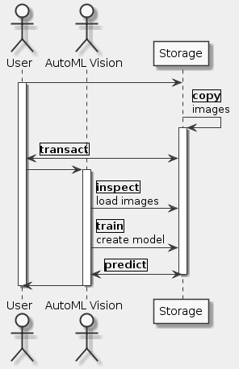

# Goal
- Uploading a labeled dataset to Google Cloud Storage and connecting it to AutoML Vision with a CSV label file
- Training a model with AutoML Vision and evaluating its accuracy
- Generating predictions on your trained model

# Task
- [x] Set up AutoML Vision
- [x] Upload traning images to Google Cloud Storage
- [x] Create a dataset
- [x] Inspect images
- [x] Train your model
- [x] Evaluate your model
- [x] Generate predictions

# Supplement


```uml
skinparam monochrome true
skinparam backgroundColor #EEEEFF

actor User as U
actor "AutoML Vision" as V
participant Storage as S

U -> S
activate U
S <-> S: |copy|\nimages
activate S
U <-> S: |transact|

U -> V
activate V
V -> S: |inspect|\nload images
V -> S: |train|\ncreate model
V <-> S: |predict|
deactivate S
V -> U
deactivate V
deactivate U
```

## Set up AutoML Vision
```sh
export PROJECT_ID=$DEVSHELL_PROJECT_ID
export QWIKLABS_USERNAME=$(whoami)
gcloud projects add-iam-policy-binding $PROJECT_ID --member="user:$QWIKLABS_USERNAME" --role="roles/automl.admin"
gcloud projects add-iam-policy-binding $PROJECT_ID --member="user:$QWIKLABS_USERNAME" --role="roles/automl.admin"
wait
gcloud projects add-iam-policy-binding $PROJECT_ID --member="serviceAccount:custom-vision@appspot.gserviceaccount.com" --role="roles/storage.admin"
gsutil mb -p $PROJECT_ID -c regional -l us-central1 gs://$PROJECT_ID-vcm/
```

## Upload traning images to Google Cloud Storage
```sh
export BUCKET=${PROJECT_ID}-vcm
gsutil -m cp -r gs://automl-codelab-clouds/* gs://${BUCKET}
```

## Create a dataset
```sh
gsutil cp gs://automl-codelab-metadata/data.csv .
sed -i -e "s/placeholder/${BUCKET}/g" ./data.csv
gsutil cp ./data.csv gs://${BUCKET}
```

## Reference
- https://cloud.google.com/vision/automl/docs/prepare
- https://cloud.google.com/inclusive-ml/
- https://developers.google.com/machine-learning/fairness-overview/