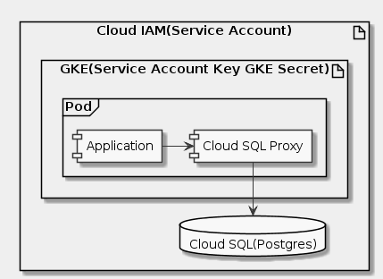

# Goal
- How to protect your database from unauthorized access by using an unprivileged service account on your Kubernetes Engine nodes
- How to put privileged service account credentials into a container running on Kubernetes Engine
- How to use the Cloud SQL Proxy to offload the work of connecting to your Cloud SQL instance and reduce your applications knowledge of your infrastructure

# Task
- [x] Overview
- [x] Architecture
- [x] Setup and requirements
- [x] Deployment
- [x] Validation
- [x] Teardown
- [x] Troubleshooting in your own environment

# Supplement


```uml
skinparam monochrome true
skinparam backgroundColor #EEEEFF

artifact "Cloud IAM(Service Account)" {
  database "Cloud SQL(Postgres)" as Q
  artifact "GKE(Service Account Key GKE Secret)" {
    frame Pod {
      component "Application" as A
      component "Cloud SQL Proxy" as P
    }
  }
}

A -> P
P --> Q
```

## Setup and requirements
```sh
gcloud config set compute/region us-central1
gcloud config set compute/zone us-central1-a
gcloud config set project qwiklabs-gcp-3eebdafc27d07896
git clone https://github.com/GoogleCloudPlatform/gke-cloud-sql-postgres-demo.git
cd gke-cloud-sql-postgres-demo
```

## Deployment
```sh
./create.sh dbadmin pgadmin

make expose
```

## Validation
```sh
make validate
```

## Teardown
```sh
make teardown
```

## Reference
- https://github.com/GoogleCloudPlatform/gke-cloud-sql-postgres-demo
- https://cloud.google.com/sql/docs/mysql/delete-instance
