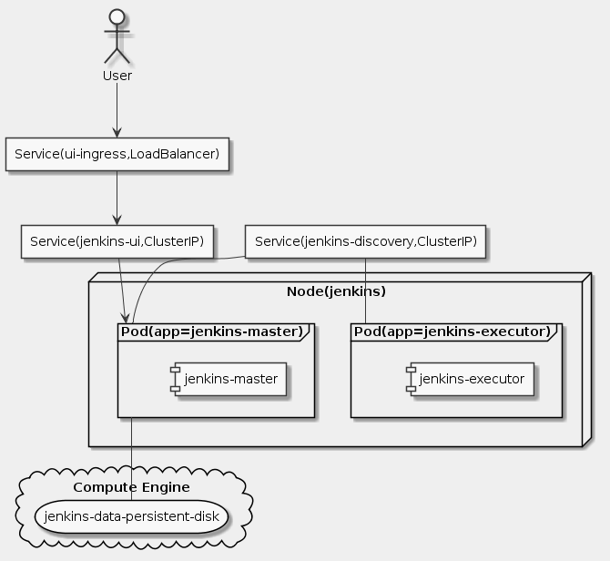

# Goal
- Provision a Jenkins application into a Kubernetes Engine Cluster
- Set up your Jenkins application using Helm Package Manager
- Explore the features of a Jenkins application
- Create and exercise a Jenkins pipeline

# Task
- [ ] Clone the repository
- [ ] Provisioning Jenkins
- [ ] Install Helm
- [ ] Configure and Install Jenkins
- [ ] Connect to Jenkins
- [ ] Understanding the Application
- [ ] Deploying the Application
- [ ] Creating the Jenkins Pipeline
- [ ] Creating the Development Environment
- [ ] Kick off Deployment
- [ ] Deploying a Canary Release
- [ ] Deploying to production

# Supplement


```uml
skinparam monochrome true
skinparam backgroundColor #EEEEFF

actor User as U
agent "Service(ui-ingress,LoadBalancer)" as S1
agent "Service(jenkins-ui,ClusterIP)" as S2
agent "Service(jenkins-discovery,ClusterIP)" as S3

node Node(jenkins) {
  frame Pod(app=jenkins-master) as P11 {
    component "jenkins-master"
  }
  frame Pod(app=jenkins-executor) as P12 {
    component "jenkins-executor"
  }
}
cloud "Compute Engine" {
  storage "jenkins-data-persistent-disk" as D
}

U --> S1
S1 --> S2
S2 --> P11
S3 -- P11
S3 -- P12
P11 -- D
```

## Clone the repository
```sh
gcloud config set compute/zone us-east1-d
git clone https://github.com/GoogleCloudPlatform/continuous-deployment-on-kubernetes.git
cd continuous-deployment-on-kubernetes
```

## Provisioning Jenkins
```sh
gcloud container clusters create jenkins-cd --num-nodes 2 --machine-type n1-standard-2 --scopes "https://www.googleapis.com/auth/projecthosting,cloud-platform"
gcloud container clusters list
gcloud container clusters get-credentials jenkins-cd
kubectl cluster-info
```

## Install Helm
```sh
wget https://storage.googleapis.com/kubernetes-helm/helm-v2.14.1-linux-amd64.tar.gz
tar zxfv helm-v2.14.1-linux-amd64.tar.gz
cp linux-amd64/helm .
kubectl create clusterrolebinding cluster-admin-binding --clusterrole=cluster-admin --user=$(gcloud config get-value account)
kubectl create serviceaccount tiller --namespace kube-system
kubectl create clusterrolebinding tiller-admin-binding --clusterrole=cluster-admin --serviceaccount=kube-system:tiller
./helm init --service-account=tiller
./helm update
./helm version
```

## Configure and Install Jenkins
```sh
./helm install -n cd stable/jenkins -f jenkins/values.yaml --version 1.2.2 --wait
kubectl get pods
kubectl create clusterrolebinding jenkins-deploy --clusterrole=cluster-admin --serviceaccount=default:cd-jenkins
export POD_NAME=$(kubectl get pods --namespace default -l "app.kubernetes.io/component=jenkins-master" -l "app.kubernetes.io/instance=cd" -o jsonpath="{.items[0].metadata.name}")
kubectl port-forward $POD_NAME 8080:8080 >> /dev/null &
kubectl get svc
```

## Connect to Jenkins
```sh
printf $(kubectl get secret cd-jenkins -o jsonpath="{.data.jenkins-admin-password}" | base64 --decode);echo
```

## Understanding the Application

## Deploying the Application
```sh
cd sample-app
kubectl create ns production
kubectl apply -f k8s/production -n production
kubectl apply -f k8s/canary -n production
kubectl apply -f k8s/services -n production
kubectl scale deployment gceme-frontend-production -n production --replicas 4
kubectl get pods -n production -l app=gceme -l role=frontend
kubectl get pods -n production -l app=gceme -l role=backend
kubectl get service gceme-frontend -n production
export FRONTEND_SERVICE_IP=$(kubectl get -o jsonpath="{.status.loadBalancer.ingress[0].ip}" --namespace=production services gceme-frontend)
curl http://$FRONTEND_SERVICE_IP/version
```

## Creating the Jenkins Pipeline
```sh
gcloud source repos create default
git init
git config credential.helper gcloud.sh
git remote add origin https://source.developers.google.com/p/$DEVSHELL_PROJECT_ID/r/default
git config --global user.email "[EMAIL_ADDRESS]"
git config --global user.name "[USERNAME]"
git add .
git commit -m "Initial commit"
git push origin master
```

## Creating the Development Environment
```sh
git checkout -b new-feature
emacs Jenkinsfile
```

## Kick off Deployment
```sh
git add Jenkinsfile html.go main.go
git commit -m "Version 2.0.0"
git push origin new-feature
kubectl proxy &
curl http://localhost:8001/api/v1/namespaces/new-feature/services/gceme-frontend:80/proxy/version
```

## Deploying a Canary Release
```sh
git checkout -b canary
git push origin canary
export FRONTEND_SERVICE_IP=$(kubectl get -o jsonpath="{.status.loadBalancer.ingress[0].ip}" --namespace=production services gceme-frontend)
while true; do curl http://$FRONTEND_SERVICE_IP/version; sleep 1; done
```

## Deploying to production
```sh
git checkout master
git merge canary
git push origin master
export FRONTEND_SERVICE_IP=$(kubectl get -o jsonpath="{.status.loadBalancer.ingress[0].ip}" --namespace=production services gceme-frontend)
while true; do curl http://$FRONTEND_SERVICE_IP/version; sleep 1; done
kubectl get service gceme-frontend -n production
```