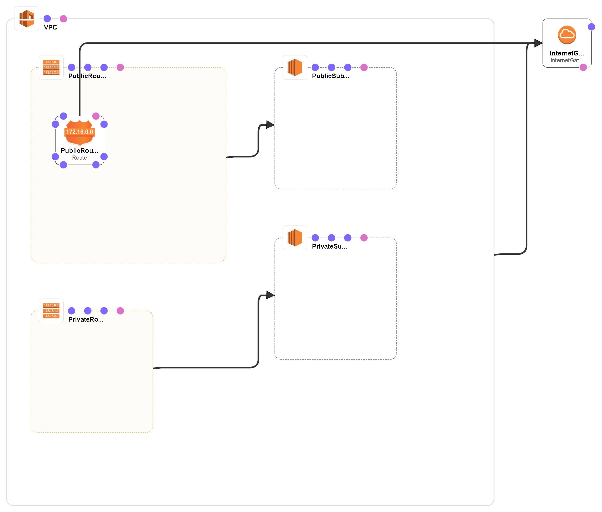
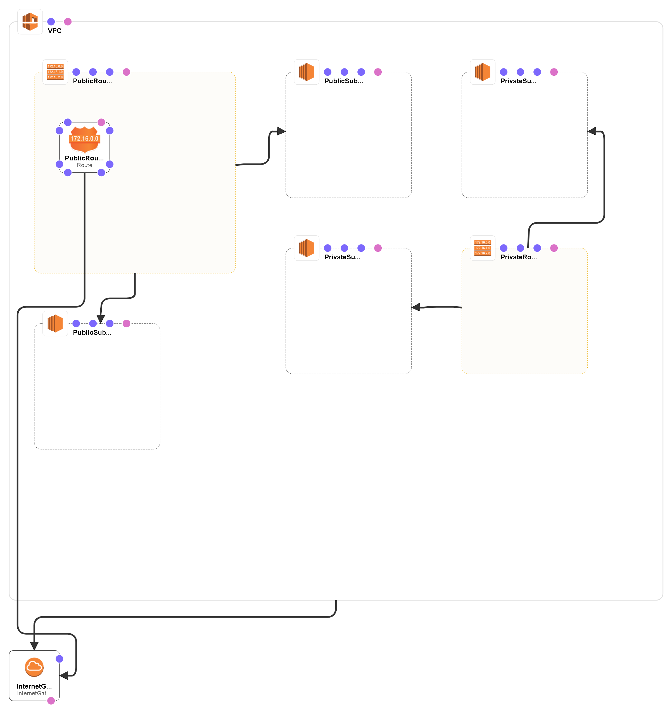

# Goal
- Deploy an AWS CloudFormation template that creates an Amazon VPC
- Examine the components of the template
- Update a CloudFormation stack
- Examine a template with the AWS CloudFormation Designer
- Delete a CloudFormation stack

# Task
- [x] Deploy a Stack using AWS CloudFormation
- [x] Examine the VPC
- [x] Updating a Stack
- [x] Viewing a Stack in CloudFormation Designer
- [x] Delete the Stack

# Supplement

## Deploy a Stack using AWS CloudFormation

[CloudFormation file](creating_an_amazon_vpc_with_aws_cloudformation___1.yaml)

## Updating a Stack

[CloudFormation file](creating_an_amazon_vpc_with_aws_cloudformation___2.yaml)

## Reference
- https://docs.aws.amazon.com/AWSCloudFormation/latest/UserGuide/Welcome.html
- https://en.wikipedia.org/wiki/Classless_Inter-Domain_Routing
- https://docs.aws.amazon.com/vpc/latest/userguide/VPC_Subnets.html
- https://docs.aws.amazon.com/vpc/latest/userguide/amazon-vpc-limits.html
- https://en.wikipedia.org/wiki/Network_address_translation
