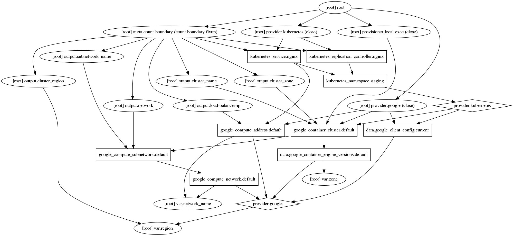
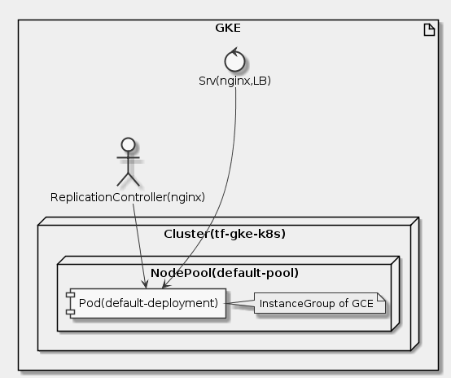

# Goal
- Deploy a Kubernetes cluster along with a service using Terraform

# Task
- [x] What you'll learn?
- [x] Setup
- [x] Kubernetes Services
- [x] Why Terraform?
- [x] Install Terraform
- [x] Clone the sample code
- [x] Understand the code
- [x] Create the terraform.tfvars file
- [x] Run Terraform

# Supplement



```uml
skinparam monochrome true
skinparam backgroundColor #EEEEFF


artifact "GKE" {
    control "Srv(nginx,LB)" as LB
    node "Cluster(tf-gke-k8s)" {
        node "NodePool(default-pool)" {
            component "Pod(default-deployment)" as Pd
            note right: InstanceGroup of GCE
        }
    }
    actor "ReplicationController(nginx)" as RC
}

LB ---> Pd
RC --> Pd
```

## Install Terraform
```sh
terraform version

wget https://github.com/warrensbox/terraform-switcher/releases/download/0.7.737/terraform-switcher_0.7.737_linux_amd64.tar.gz
mkdir -p ${HOME}/bin
tar -xvf terraform-switcher_0.7.737_linux_amd64.tar.gz -C ${HOME}/bin
export PATH=$PATH:${HOME}/bin
tfswitch -b ${HOME}/bin/terraform 0.11.14
echo "0.11.14" >> .tfswitchrc
exec -l $SHELL

terraform version
```

## Clone the sample code
```sh
git clone https://github.com/GoogleCloudPlatform/terraform-google-examples.git
cd terraform-google-examples/example-gke-k8s-service-lb
```

## Understand the code
```sh
cat main.tf
cat k8s.tf
```

## Create the terraform.tfvars file
```sh
cat <<EOF >terraform.tfvars
gke_username = "admin"
gke_password = "$(openssl rand -base64 16)"
EOF
```

## Run Terraform
```sh
terraform init
terraform plan -out=tfplan
terraform apply tfplan
./test.sh
```

## Reference
- https://www.terraform.io/docs/commands/graph.html
- https://kubernetes.io/docs/concepts/workloads/controllers/replicationcontroller/