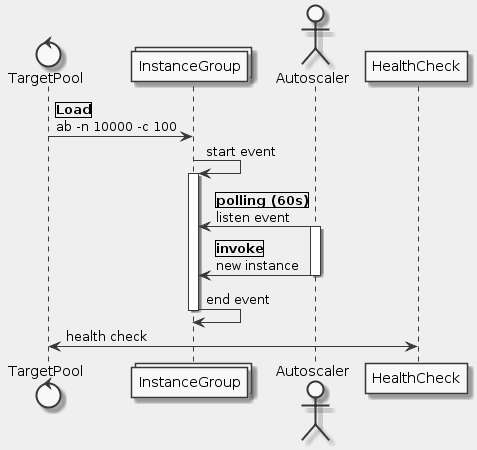

# Goal
- Install and configure an advanced deployment using Deployment Manager sample templates
- Enable Stackdriver monitoring
- Configure Stackdriver Uptime Checks and notifications
- Configure a Stackdriver dashboard with two charts, one showing CPU usage and the other ingress traffic
- Perform a load test and simulate a service outage

# Task
- [x] Clone the Deployment Manager Sample Templates
- [x] Explore the Sample Files
- [x] Customize the Deployment
- [x] Run the Application
- [x] Verify that the application is operational
- [x] Create Stackdriver workspace
- [x] Configure an uptime check and alert policy in Stackdriver
- [x] Configure an alerting policy and notification
- [x] Configure a Dashboard with a Couple of Useful Charts
- [x] Create a test VM with ApacheBench
- [x] Simulate a Service Outage
- [x] Test your knowledge

# Supplement


```uml
skinparam monochrome true
skinparam backgroundColor #EEEEFF

control "TargetPool" as TP
collections "InstanceGroup" as IG
actor "Autoscaler" as AS
participant "HealthCheck" as HC

TP -> IG: |Load|\nab -n 10000 -c 100
IG -> IG: start event
activate IG
AS -> IG: listen event
activate AS
AS -> IG: |invoke|\nnew instance
deactivate AS
IG -> IG: end event
deactivate IG

TP <-> HC: health check
```

https://github.com/GoogleCloudPlatform/deploymentmanager-samples/tree/master/examples/v2/nodejs
https://cloud.google.com/deployment-manager/docs/create-advanced-deployment


## Clone the Deployment Manager Sample Templates
```sh
mkdir ~/dmsamples
cd ~/dmsamples
git clone https://github.com/GoogleCloudPlatform/deploymentmanager-samples.git
```

## Explore the Sample Files
```sh
cd ~/dmsamples/deploymentmanager-samples/examples/v2
ls
cd nodejs/python
ls
```

## Customize the Deployment
```sh
gcloud compute zones list

nano nodejs.yaml

nano nodejs.py
```

## Run the Application
```sh
gcloud deployment-manager deployments create advanced-configuration --config nodejs.yaml
```

## Verify that the application is operational
```sh
export YOUR_IP=$(gcloud compute forwarding-rules list | awk '{print $3}' | tail -1)
http://35.243.164.47:8080
curl -k http://$YOUR_IP:8080/?msg=hello
curl -k http://$YOUR_IP:8080
```

## Create a test VM with ApacheBench
```sh
sudo apt-get update
sudo apt-get -y install apache2-utils
export YOUR_IP=35.243.164.47
ab -n 1000 -c 100 http://$YOUR_IP:8080/
ab -n 5000 -c 100 http://$YOUR_IP:8080/
ab -n 10000 -c 100 http://$YOUR_IP:8080/
ab -n 10000 -c 100 http://$YOUR_IP:8080/
ab -n 10000 -c 100 http://$YOUR_IP:8080/
```

## Reference
- https://cloud.google.com/deployment-manager/docs/fundamentals
- https://cloud.google.com/deployment-manager/docs/tutorials
- https://cloud.google.com/deployment-manager/docs/create-advanced-http-load-balanced-deployment
