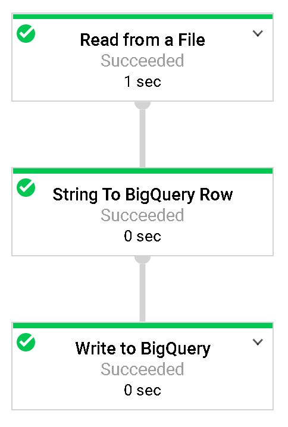
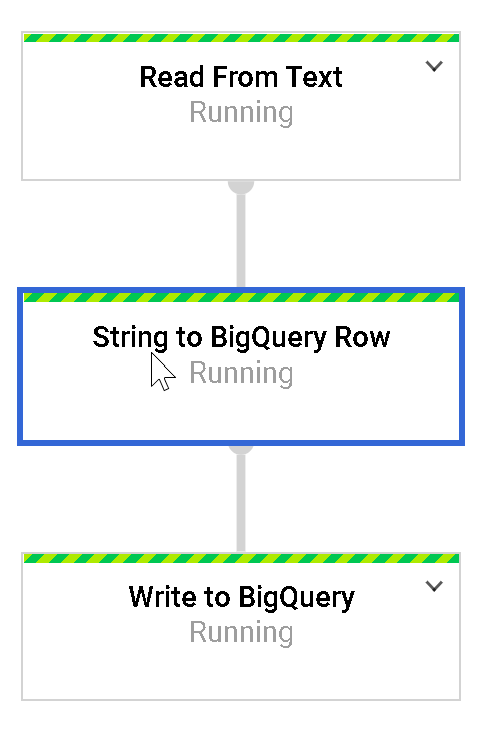
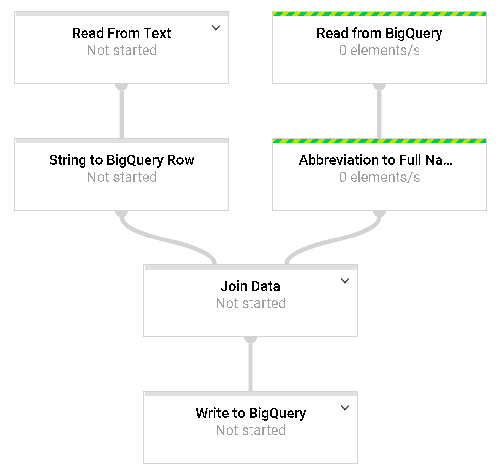
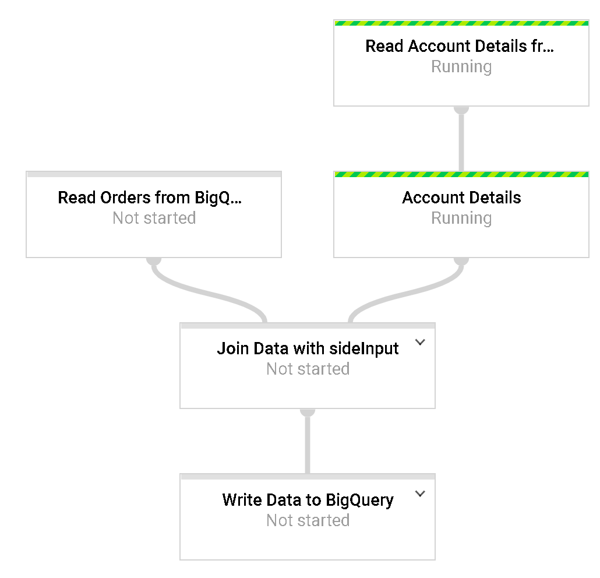
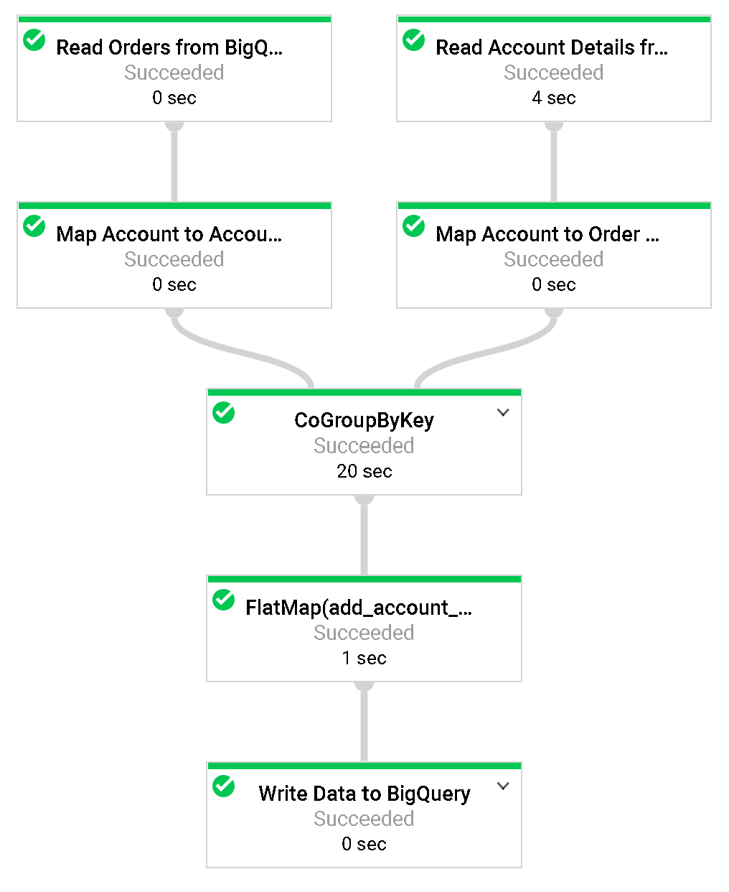

# Goal
- ETL Processing on GCP Using Dataflow and BigQuery

# Task
- [x] Build a Dataflow Pipeline

# Supplement
## Download start code
```sh
git clone https://github.com/GoogleCloudPlatform/professional-services.git
export PROJECT=qwiklabs-gcp-4c2eb34d53836814
gcloud config set project $PROJECT
gsutil mb -c regional -l us-central1 gs://$PROJECT
```

## Copy files to bucket
```sh
gsutil cp gs://python-dataflow-example/data_files/usa_names.csv gs://$PROJECT/data_files/
gsutil cp gs://python-dataflow-example/data_files/head_usa_names.csv gs://$PROJECT/data_files/
```

## Create dataset of BigQuery
```sh
bq mk lake
```

## Build a Dataflow Pipeline
https://github.com/GoogleCloudPlatform/professional-services/blob/master/examples/dataflow-python-examples/dataflow_python_examples

**Step 2. Execute pipeline of Dataflow**


```sh
cd professional-services/examples/dataflow-python-examples/
# Here we set up the python environment.
# Pip is a tool, similar to maven in the java world
sudo pip install --upgrade virtualenv

#Dataflow requires python 2.7
virtualenv -p `which python 2.7` dataflow-env

source dataflow-env/bin/activate
pip install apache-beam[gcp]
```

```sh
python dataflow_python_examples/data_ingestion.py --project=$PROJECT --runner=DataflowRunner --staging_location=gs://$PROJECT/test --temp_location gs://$PROJECT/test --input gs://$PROJECT/data_files/head_usa_names.csv --save_main_session
```

**Step 3. Transform data**


```sh
python dataflow_python_examples/data_transformation.py --project=$PROJECT --runner=DataflowRunner --staging_location=gs://$PROJECT/test --temp_location gs://$PROJECT/test --input gs://$PROJECT/data_files/head_usa_names.csv --save_main_session
```

**Step 4. Enrich data**


```sh
python dataflow_python_examples/data_enrichment.py --project=$PROJECT --runner=DataflowRunner --staging_location=gs://$PROJECT/test --temp_location gs://$PROJECT/test --input gs://$PROJECT/data_files/head_usa_names.csv --save_main_session
```

**Step 5. lake to mart**


```sh
python dataflow_python_examples/data_lake_to_mart.py --worker_disk_type="compute.googleapis.com/projects//zones//diskTypes/pd-ssd" --max_num_workers=4 --project=$PROJECT --runner=DataflowRunner --staging_location=gs://$PROJECT/test --temp_location gs://$PROJECT/test --save_main_session
```

**Step 6. lake to mart (CoGroupByKey)**


```sh
python dataflow_python_examples/data_lake_to_mart_cogroupbykey.py --worker_disk_type="compute.googleapis.com/projects//zones//diskTypes/pd-ssd" --max_num_workers=4 --project=$PROJECT --runner=DataflowRunner --staging_location=gs://$PROJECT/test --temp_location gs://$PROJECT/test --save_main_session
```

## Reference
- https://beam.apache.org/documentation/programming-guide/
