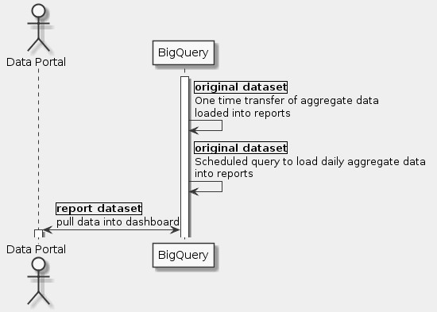
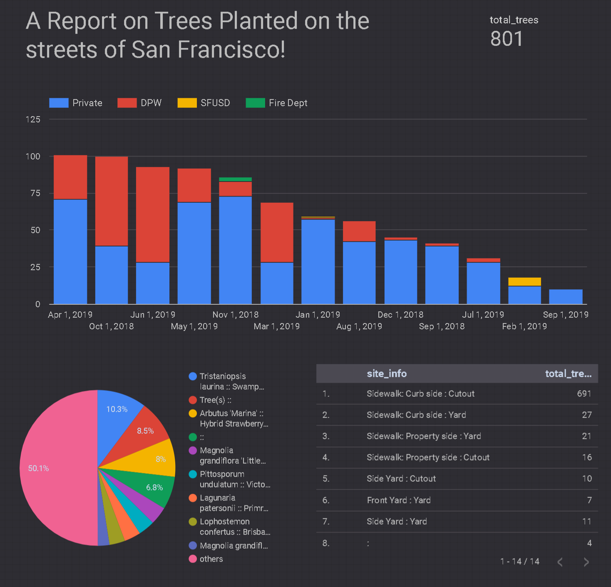

# Goal
- Build a BI Dashboard Using Google Data Studio and BigQuery

# Task
- [x] Uploading queryable data
- [x] Create a reports dataset in BigQuery
- [x] Query the dashboard data
- [x] Scheduling queries in BigQuery
- [x] Create new data sources in Data Studio
- [x] Create a new report in Data Studio

# Supplement


```uml
skinparam monochrome true
skinparam backgroundColor #EEEEFF

actor "Data Portal" as D
participant BigQuery as B

activate B
B -> B: |original dataset|\nOne time transfer of aggregate data \nloaded into reports
B -> B: |original dataset|\nScheduled query to load daily aggregate data \ninto reports
D <-> B: |report dataset|\npull data into dashboard
activate D
```

## Create a reports dataset in BigQuery
- [bigquery-public-data]-[Street Trees]

## Query the dashboard data
```sql
SELECT
 TIMESTAMP_TRUNC(plant_date, MONTH) as plant_month,
  COUNT(tree_id) AS total_trees,
  species,
  care_taker,
  address,
  site_info
FROM
  `bigquery-public-data.san_francisco_trees.street_trees`
WHERE
  address IS NOT NULL
  AND plant_date >= TIMESTAMP_SUB(CURRENT_TIMESTAMP(), INTERVAL 365 DAY)
  AND plant_date < TIMESTAMP_TRUNC(CURRENT_TIMESTAMP(), DAY)
GROUP BY
  plant_month,
  species,
  care_taker,
  address,
  site_info
```

## Scheduling queries in BigQuery
```sql
SELECT
 TIMESTAMP_TRUNC(plant_date, MONTH) as plant_month,
  COUNT(tree_id) AS total_trees,
  species,
  care_taker,
  address,
  site_info
FROM
  `bigquery-public-data.san_francisco_trees.street_trees`

WHERE
  address IS NOT NULL
  AND plant_date >= TIMESTAMP_SUB(CURRENT_TIMESTAMP(), INTERVAL 1 DAY)
  AND plant_date < TIMESTAMP_TRUNC(CURRENT_TIMESTAMP(), DAY)
GROUP BY
  plant_month,
  species,
  care_taker,
  address,
  site_info
```

## Create a new report in Data Studio

