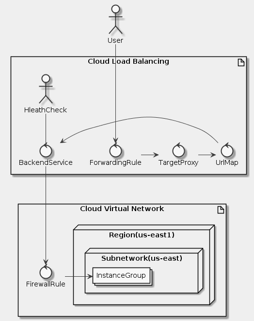

# Goal
- Create HTTP and health check firewall rules
- Configure two instance templates
- Create two managed instance groups
- Configure an HTTP Load Balancer with IPv4 and IPv6
- Stress test an HTTP Load Balancer
- Blacklist an IP address to restrict access to an HTTP Load Balancer

# Task
- [x] Configure HTTP and health check firewall rules
- [x] Configure instance templates and create instance groups
- [x] Configure the HTTP Load Balancer
- [x] Test the HTTP Load Balancer
- [x] Blacklist the siege-vm

# Supplement


```uml
skinparam monochrome true
skinparam backgroundColor #EEEEFF

actor User as U
artifact "Cloud Load Balancing" {
  control ForwardingRule as Fwd
  control "TargetProxy" as TP
  control UrlMap as UM
  control "BackendService" as BS
  actor HleathCheck as HC
}

artifact "Cloud Virtual Network" {
  control FirewallRule as Fwl
  node "Region(us-east1)" {
    node "Subnetwork(us-east)" {
      collections InstanceGroup as IG
    }
  }
}

U ---> Fwd

Fwd -> TP
TP -> UM
UM -> BS
HC -- BS

BS ---> Fwl

Fwl -> IG
```

## Configure HTTP and health check firewall rules
```sh
export PROJECT=$(gcloud config list --format "value(core.project)")
export GCE_ACCOUNT=$(gcloud iam service-accounts list --filter "Compute Engine default service account"  --format "value(EMAIL)")

gcloud compute firewall-rules create default-allow-http \
    --project=$PROJECT \
    --direction=INGRESS \
    --target-tags=http-server \
    --priority=1000 \
    --network=default \
    --action=ALLOW \
    --rules=tcp:80 \
    --source-ranges=0.0.0.0/0

gcloud compute firewall-rules create default-allow-health-check \
    --project=$PROJECT \
    --direction=INGRESS \
    --priority=1000 \
    --network=default \
    --action=ALLOW \
    --rules=tcp \
    --target-tags=http-server \
    --source-ranges=130.211.0.0/22,35.191.0.0/16
```

## Configure instance templates and create instance groups
**startup-script-url (gs://cloud-training/gcpnet/httplb/startup.sh)**
```sh
#! /bin/bash

apt-get update
apt-get install -y apache2 php
cd /var/www/html
rm index.html -f
rm index.php -f
wget https://storage.googleapis.com/cloudnet-lab/index.php
META_REGION_STRING=$(curl "http://metadata.google.internal/computeMetadata/v1/instance/zone" -H "Metadata-Flavor: Google")
REGION=`echo "$META_REGION_STRING" | awk -F/ '{print $4}'`
sed -i "s|region-here|$REGION|" index.php
```

```sh
gcloud beta compute instance-templates create us-east1-template \
    --project=$PROJECT \
    --machine-type=n1-standard-1 \
    --subnet=projects/$PROJECT/regions/us-east1/subnetworks/default \
    --network-tier=PREMIUM \
    --maintenance-policy=MIGRATE \
    --service-account=$GCE_ACCOUNT \
    --scopes=https://www.googleapis.com/auth/devstorage.read_only,https://www.googleapis.com/auth/logging.write,https://www.googleapis.com/auth/monitoring.write,https://www.googleapis.com/auth/servicecontrol,https://www.googleapis.com/auth/service.management.readonly,https://www.googleapis.com/auth/trace.append \
    --region=us-east1 \
    --tags=http-server \
    --image=debian-9-stretch-v20190916 \
    --image-project=debian-cloud \
    --boot-disk-size=10GB \
    --boot-disk-type=pd-standard \
    --boot-disk-device-name=us-east1-template \
    --metadata=startup-script-url=gs://cloud-training/gcpnet/httplb/startup.sh \
    --reservation-affinity=any

gcloud beta compute instance-templates create europe-west1-template \
    --project=$PROJECT \
    --machine-type=n1-standard-1 \
    --subnet=projects/$PROJECT/regions/europe-west1/subnetworks/default \
    --network-tier=PREMIUM \
    --metadata=startup-script-url=gs://cloud-training/gcpnet/httplb/startup.sh \
    --maintenance-policy=MIGRATE \
    --service-account=$GCE_ACCOUNT \
    --scopes=https://www.googleapis.com/auth/devstorage.read_only,https://www.googleapis.com/auth/logging.write,https://www.googleapis.com/auth/monitoring.write,https://www.googleapis.com/auth/servicecontrol,https://www.googleapis.com/auth/service.management.readonly,https://www.googleapis.com/auth/trace.append \
    --region=europe-west1 \
    --tags=http-server \
    --image=debian-9-stretch-v20190916 \
    --image-project=debian-cloud \
    --boot-disk-size=10GB \
    --boot-disk-type=pd-standard \
    --boot-disk-device-name=europe-west1-template \
    --reservation-affinity=any

gcloud beta compute instance-groups managed create us-east1-mig \
    --project=$PROJECT \
    --base-instance-name=us-east1-mig \
    --template=us-east1-template \
    --size=1 \
    --zones=us-east1-b,us-east1-c,us-east1-d \
    --instance-redistribution-type=PROACTIVE
gcloud beta compute instance-groups managed set-autoscaling "us-east1-mig" \
    --project $PROJECT \
    --region "us-east1" \
    --cool-down-period "45" \
    --max-num-replicas "5" \
    --min-num-replicas "1" \
    --target-cpu-utilization "0.8"

gcloud beta compute instance-groups managed create europe-west1-mig \
    --project=$PROJECT \
    --base-instance-name=europe-west1-mig \
    --template=europe-west1-template \
    --size=1 \
    --zones=europe-west1-b,europe-west1-c,europe-west1-d \
    --instance-redistribution-type=PROACTIVE
gcloud beta compute instance-groups managed set-autoscaling "europe-west1-mig" \
    --project $PROJECT \
    --region "europe-west1" \
    --cool-down-period "45" \
    --max-num-replicas "5" \
    --min-num-replicas "1" \
    --target-cpu-utilization "0.8"
```

## Configure the HTTP Load Balancer
## Test the HTTP Load Balancer
```sh
gcloud beta compute instances create siege-vm \
    --project=$PROJECT \
    --zone=us-west1-c \
    --machine-type=n1-standard-1 \
    --subnet=default \
    --network-tier=PREMIUM \
    --maintenance-policy=MIGRATE \
    --service-account=$GCE_ACCOUNT \
    --scopes=https://www.googleapis.com/auth/devstorage.read_only,https://www.googleapis.com/auth/logging.write,https://www.googleapis.com/auth/monitoring.write,https://www.googleapis.com/auth/servicecontrol,https://www.googleapis.com/auth/service.management.readonly,https://www.googleapis.com/auth/trace.append \
    --image=debian-9-stretch-v20190916 \
    --image-project=debian-cloud \
    --boot-disk-size=10GB \
    --boot-disk-type=pd-standard \
    --reservation-affinity=any
```

```sh
sudo apt-get -y install siege
export LB_IP=34.98.107.178:80
siege -c 250 http://$LB_IP
```

## Blacklist the siege-vm
```sh
# siege-vm
export SIEGE_IP=130.211.1.207

gcloud compute security-policies create blacklist-siege \
    --project=$PROJECT
gcloud compute security-policies rules create 1000 \
    --project=$PROJECT \
    --action=deny\(403\) \
    --security-policy=blacklist-siege \
    --src-ip-ranges=$SIEGE_IP
gcloud compute security-policies rules create 2147483647 \
    --project=$PROJECT \
    --action=allow \
    --security-policy=blacklist-siege \
    --description="Default rule, higher priority overrides it" \
    --src-ip-ranges=\*
gcloud compute backend-services update http-backend \
    --project=$PROJECT \
    --security-policy=blacklist-siege
```

```sh
curl http://$LB_IP
siege -c 250 http://$LB_IP
```

## Reference
- https://cloud.google.com/armor/docs/
- https://cloud.google.com/load-balancing/docs/
- https://cloud.google.com/compute/docs/labeling-resources
- https://cloud.google.com/compute/docs/autoscaler/
- https://cloud.google.com/vpc/docs/using-flow-logs
