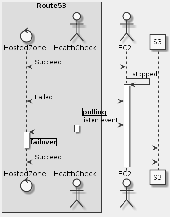

# Goal
- Create a hosted zone for your domain
- Create DNS records for Amazon EC2 instances
- Add a Route 53 health check to an Amazon EC2 Web Server
- Configure a DNS Failover to an Amazon S3 static website
- Test the health check and failover

# Task
- [x] Introducing the Technologies
- [x] Task 1: Create a Hosted Zone For Your Domain
- [x] Task 2: Create DNS Records For Amazon EC2 Instances
- [x] Task 3: Add a Route 53 Health Check to an Amazon EC2 Web Server
- [x] Task 4: Configure a DNS Failover to an Amazon S3 Static Website
- [x] Task 5: Test the Health Check and Failover

# Supplement


```uml
skinparam monochrome true
skinparam backgroundColor #EEEEFF

box "Route53"
    control HostedZone as HZ
    actor HealthCheck as HC
end box

actor EC2 as E
participant S3 as S

HZ <-> E: Succeed
E -> E: stopped
activate E
HZ <-> E: Failed
HC -> E: |polling|\nlisten event
activate HC
HC -> HZ
deactivate HC
activate HZ
HZ -> S: |failover|
deactivate HZ
HZ <-> S: Succeed
```

## Reference
- https://docs.aws.amazon.com/route53/index.html
