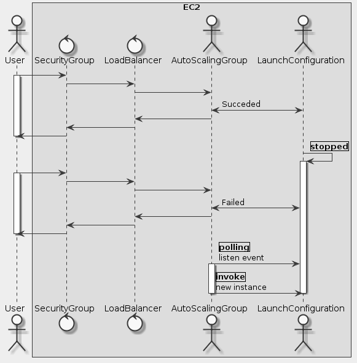

# Goal
- Create an Amazon Simple Storage Service (S3) bucket using AWS CloudFormation
- Provision a simple PHP web application using an Amazon Linux AMI
- Apply an AWS CloudFormation template to an existing application
- Modify an existing application using AWS CloudFormation
- Add IAM roles and Elastic Load Balancing to the application using AWS CloudFormation

# Task
- [x] Task 1: Create an Amazon S3 bucket using AWS CloudFormation
- [x] Task 2: Delete the Stack
- [x] Task 3: Change The Retention Policy
- [x] Task 4: Provision a Web Application
- [x] Task 5: Change Resources Properties
- [x] Task 6: Add Resources Properties
- [x] Task 7: Create an Auto-Scaled Application

# Supplement


```uml
skinparam monochrome true
skinparam backgroundColor #EEEEEE

actor User as U

box EC2
    control SecurityGroup as SG
    control LoadBalancer as LB
    actor AutoScalingGroup as AS
    actor LaunchConfiguration as LC
end box

U -> SG
activate U
SG -> LB
LB -> AS
AS <-> LC: Succeded
AS -> LB
LB -> SG
SG -> U
deactivate U

LC -> LC: |stopped|
activate LC

U -> SG
activate U
SG -> LB
LB -> AS
AS <-> LC: Failed
AS -> LB
LB -> SG
SG -> U
deactivate U

AS -> LC: |polling|\nlisten event
activate AS
AS -> LC: |invoke|\nnew instance
deactivate LC
deactivate AS
```

## Task 1: Create an Amazon S3 bucket using AWS CloudFormation
```yaml
AWSTemplateFormatVersion: 2010-09-09
Description: Basic S3 Bucket CloudFormation template
Resources:
  S3BucketForWebsiteContent:
    Type: AWS::S3::Bucket
    Properties:
      AccessControl: PublicRead
Outputs:
  BucketName:
    Value: !Ref S3BucketForWebsiteContent
    Description: Name of the newly created Amazon S3 Distribution
```

## Task 3: Change The Retention Policy
```yaml
AWSTemplateFormatVersion: 2010-09-09
Description: Basic S3 Bucket CloudFormation template
Resources:
  S3BucketForWebsiteContent:
    Type: AWS::S3::Bucket
    DeletionPolicy: Retain
    Properties:
      AccessControl: PublicRead
Outputs:
  BucketName:
    Value: !Ref S3BucketForWebsiteContent
    Description: Name of the newly created Amazon S3 Distribution
```

## Task 4: Provision a Web Application
https://s3-us-west-2.amazonaws.com/us-west-2-aws-training/awsu-spl/spl-10/3.6.11.prod/scripts/lab3.yaml

## Task 5: Change Resources Properties
```yaml
Mappings:
  EC2TypeConfig:
    prod:
      InstanceType: t2.small
    dev:
      InstanceType: t2.micro
  ENV:
    Type: String
    Default: dev
    AllowedValues:
      - dev
      - prod
```

## Task 6: Add Resources Properties
```yaml
    Properties:
      Tags:
        - Key: Name
          Value: Web server - port 80 and 22
```

```yaml
  WebServerSecurityGroup:
    Type: AWS::EC2::SecurityGroup
    Properties:
      GroupDescription: Enable HTTP
      VpcId: !Ref VPCId
      SecurityGroupIngress:
        - IpProtocol: tcp
          FromPort: 80
          ToPort: 80
          CidrIp: 0.0.0.0/0
        - IpProtocol: tcp
          FromPort: 22
          ToPort: 22
          CidrIp: 0.0.0.0/0
```

## Task 7: Create an Auto-Scaled Application
```yaml
  WebServerInstanceProfile:
    Type: AWS::IAM::InstanceProfile
    Properties:
      Path: /
      Roles:
        - ec2-role-2
```
```yaml
  Endpoint:
    Type: AWS::EC2::EIP
    Properties:
      InstanceId: !Ref WebServerHost
```
```yaml
  ElasticLoadBalancer:
    Type: AWS::ElasticLoadBalancing::LoadBalancer
    Properties:
      Subnets:
        - !Ref VPCPublicSubnetId
      SecurityGroups:
        - !Ref WebServerSecurityGroup
      Listeners:
        - LoadBalancerPort: 80
          InstancePort: 80
          Protocol: HTTP
      HealthCheck:
        Target: HTTP:80/
        HealthyThreshold: 3
        UnhealthyThreshold: 5
        Interval: 30
        Timeout: 5
```
```yaml
  WebServerHost:
    Type: AWS::EC2::Instance
```
```yaml
  WebServerConfig:
    Type: AWS::AutoScaling::LaunchConfiguration
```
```yaml
WebServerGroup:
    Type: AWS::AutoScaling::AutoScalingGroup
    Properties:
      AvailabilityZones:
        - !Ref VPCPublicSubnetAZ
      LaunchConfigurationName: !Ref WebServerConfig
      MinSize: 2
      MaxSize: 3
      LoadBalancerNames:
        - !Ref ElasticLoadBalancer
      VPCZoneIdentifier:
        - !Ref VPCPublicSubnetId
```
```yaml
  WebServerSecurityGroup:
    Type: AWS::EC2::SecurityGroup
    Properties:
      GroupDescription: Enable HTTP
      VpcId: !Ref VPCId
      SecurityGroupIngress:
        - IpProtocol: tcp
          FromPort: 80
          ToPort: 80
          CidrIp: 0.0.0.0/0
```
```yaml
Outputs:
  WebsiteURL:
    Value: !Sub 'http://${ElasticLoadBalancer.DNSName}'
    Description: Application URL
```

## Reference
- https://s3.amazonaws.com/cloudformation-examples/BoostrappingApplicationsWithAWSCloudFormation.pdf
