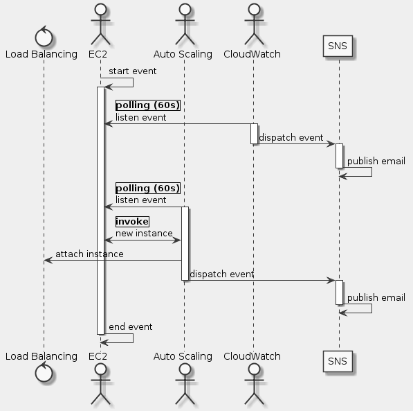

# Goal
- Create a new launch configuration using command-line tools
- Create a new Auto Scaling group using command line tools
- Configure Auto Scaling notifications that are triggered when instance resources become too high or too low
- Create policies to scale up or scale down the number of currently running instances in response to changes in resource utilization

# Task
- [x] Start Lab
- [x] Windows Users: Connecting to your Amazon EC2 Instance via SSH
- [x] OSX and Linux Users: Connecting to your Amazon EC2 Instance via SSH
- [x] Gather Lab Environment And Resource Details
- [x] Configure AWS CLI
- [x] Create a Launch Configuration
- [x] Create an Auto Scaling Group
- [x] Verifying Auto Scaling
- [x] Verify that the Auto Scaling servers were launched
- [x] Create Auto Scaling Notifications
- [x] Create Auto Scaling Policies
- [x] Test Auto Scaling

# Supplement


```uml
skinparam monochrome true
skinparam backgroundColor #EEEEFF

control "Load Balancing" as B
actor EC2 as C
actor "Auto Scaling" as S
actor "CloudWatch" as W
participant SNS as N

C -> C: start event
activate C

W -> C: |polling (60s)|\nlisten event
activate W
W -> N: dispatch event
deactivate W
activate N
N -> N: publish email
deactivate N

S -> C: |polling (60s)|\nlisten event
deactivate W
activate S
S <-> C: |invoke|\nnew instance
S -> B: attach instance
S -> N: dispatch event
deactivate S
activate N
N -> N: publish email
deactivate N

C -> C: end event
deactivate C
```

## OSX and Linux Users: Connecting to your Amazon EC2 Instance via SSH
```sh
chmod 600 ~/.ssh/qwiklab-l33-5018.pem
ssh -i ~/.ssh/qwiklab-l33-5018.pem ec2-user@<public DNS>
```

## Gather Lab Environment And Resource Details
```sh
ssh> cat ~/lab-details.txt
```

## Configure AWS CLI
```sh
aws configure
```

## Create a Launch Configuration
```sh
aws autoscaling create-launch-configuration \
    --image-id ami-08d489468314a58df \
    --instance-type t2.micro \
    --key-name qwikLABS-L2037-8961675 \
    --security-groups qls-8961675-4364bfaaaec26911-Ec2SecurityGroup-8HH9D9RK9N7T \
    --user-data file:///home/ec2-user/as-bootstrap.sh \
    --launch-configuration-name lab-lc
```

## Create an Auto Scaling Group
```sh
aws autoscaling create-auto-scaling-group \
    --auto-scaling-group-name lab-as-group \
    --availability-zones us-west-2a \
    --launch-configuration-name lab-lc \
    --load-balancer-names qls-89616-ElasticL-W0O9LEJQU4MK \
    --max-size 4 \
    --min-size 1
```

## Verifying Auto Scaling
```sh
aws autoscaling create-or-update-tags \
    --tags "ResourceId=lab-as-group, ResourceType=auto-scaling-group, Key=Name, Value=AS-Web-Server, PropagateAtLaunch=true"
```

## Verify that the Auto Scaling servers were launched
```sh
aws autoscaling put-notification-configuration \
    --auto-scaling-group-name lab-as-group \
    --topic-arn arn:aws:sns:us-west-2:973443609825:lab-as-topic \
    --notification-types autoscaling:EC2_INSTANCE_LAUNCH autoscaling:EC2_INSTANCE_TERMINATE
```

## Create Auto Scaling Notifications
```sh
aws autoscaling put-scaling-policy \
    --policy-name lab-scale-up-policy \
    --auto-scaling-group-name lab-as-group \
    --scaling-adjustment 1 \
    --adjustment-type ChangeInCapacity \
    --cooldown 300 \
    --query 'PolicyARN' \
    --output text
aws autoscaling put-scaling-policy \
    --policy-name lab-scale-down-policy \
    --auto-scaling-group-name lab-as-group \
    --scaling-adjustment -1 \
    --adjustment-type ChangeInCapacity \
    --cooldown 300 \
    --query 'PolicyARN' \
    --output text
```

## Create Auto Scaling Policies
## Test Auto Scaling
```sh
aws autoscaling describe-scaling-activities \
    --auto-scaling-group-name lab-as-group
```

## Reference
- https://docs.aws.amazon.com/ja_jp/autoscaling/index.html
- http://awsdocs.s3.amazonaws.com/AutoScaling/latest/as-qrc.pdf
