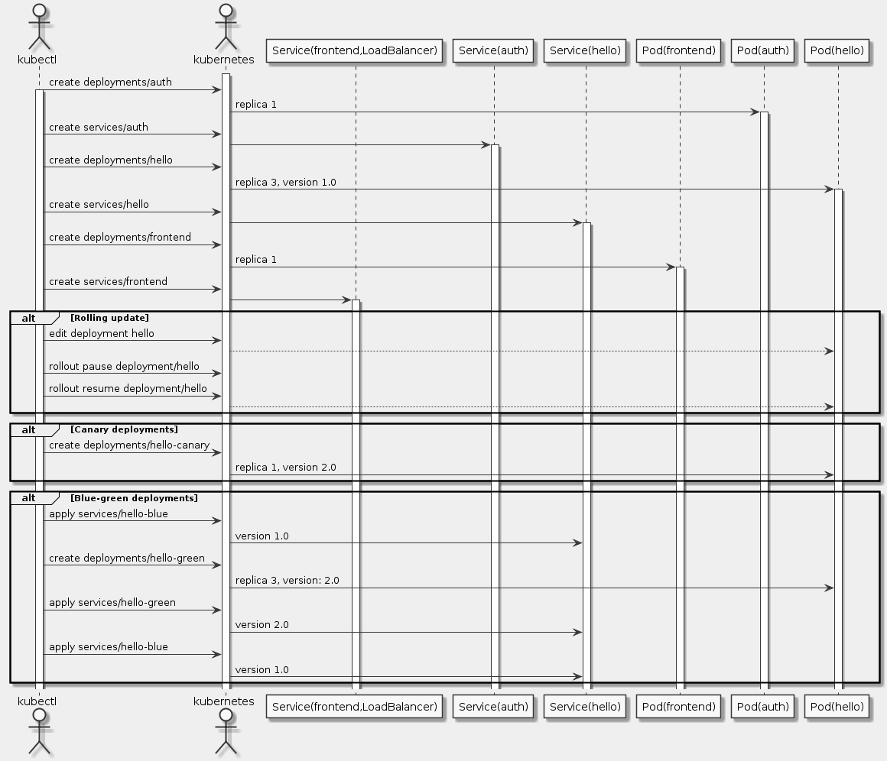

# Goal
- Practice with kubectl tool
- Create deployment yaml files
- Launch, update, and scale deployments
- Practice with updating deployments and deployment styles

# Task
- [x] Introduction to deployments
- [x] Setup
- [x] Learn about the deployment object
- [x] Create a deployment
- [x] Rolling update
- [x] Canary deployments
- [x] Blue-green deployments

# Supplement


```uml
skinparam monochrome true
skinparam backgroundColor #EEEEFF

actor kubectl as C
actor kubernetes as K
participant "Service(frontend,LoadBalancer)" as SF
participant "Service(auth)" as SA
participant "Service(hello)" as SH
participant "Pod(frontend)" as PF
participant "Pod(auth)" as PA
participant "Pod(hello)" as PH

activate K
C -> K: create deployments/auth
activate C
K -> PA: replica 1
activate PA
C -> K: create services/auth
K -> SA
activate SA
C -> K: create deployments/hello
K -> PH: replica 3, version 1.0
activate PH
C -> K: create services/hello
K -> SH
activate SH
C -> K: create deployments/frontend
K -> PF: replica 1
activate PF
C -> K: create services/frontend
K -> SF
activate SF

alt Rolling update
  C -> K: edit deployment hello
  K --> PH
  C -> K: rollout pause deployment/hello
  C -> K: rollout resume deployment/hello
  K --> PH
end

alt Canary deployments
  C -> K: create deployments/hello-canary
  K -> PH: replica 1, version 2.0
end

alt Blue-green deployments
  C -> K: apply services/hello-blue
  K -> SH: version 1.0
  C -> K: create deployments/hello-green
  K -> PH: replica 3, version: 2.0
  C -> K: apply services/hello-green
  K -> SH: version 2.0
  C -> K: apply services/hello-blue
  K -> SH: version 1.0
end
```

## Setup
```sh
gcloud config set project qwiklabs-gcp-813ad75ef8dcf494
gcloud config set compute/zone us-central1-a
git clone https://github.com/googlecodelabs/orchestrate-with-kubernetes.git
cd orchestrate-with-kubernetes/kubernetes
gcloud container clusters create bootcamp --num-nodes 5 --scopes "https://www.googleapis.com/auth/projecthosting,storage-rw"
```

## Learn about the deployment object
```sh
kubectl explain deployment
kubectl explain deployment --recursive
kubectl explain deployment.metadata.name
```

## Create a deployment
```sh
cat deployments/auth.yaml
kubectl create -f deployments/auth.yaml
kubectl get deployments
kubectl get replicasets
kubectl get pods
kubectl create -f services/auth.yaml
kubectl create -f deployments/hello.yaml
kubectl create -f services/hello.yaml
kubectl create secret generic tls-certs --from-file tls/
kubectl create configmap nginx-frontend-conf --from-file=nginx/frontend.conf
kubectl create -f deployments/frontend.yaml
kubectl create -f services/frontend.yaml
kubectl get services frontend
curl -ks https://34.69.169.81
curl -ks https://`kubectl get svc frontend -o=jsonpath="{.status.loadBalancer.ingress[0].ip}"`

kubectl explain deployment.spec.replicas
kubectl scale deployment hello --replicas=5
kubectl get pods | grep hello- | wc -l
kubectl scale deployment hello --replicas=3
kubectl get pods | grep hello- | wc -l
```

## Rolling update
```sh
kubectl edit deployment hello
kubectl get replicaset
kubectl rollout history deployment/hello

kubectl rollout pause deployment/hello
kubectl rollout status deployment/hello
kubectl get pods -o jsonpath --template='{range .items[*]}{.metadata.name}{"\t"}{"\t"}{.spec.containers[0].image}{"\n"}{end}'

kubectl rollout resume deployment/hello
kubectl rollout status deployment/hello

kubectl rollout undo deployment/hello
kubectl rollout history deployment/hello
kubectl get pods -o jsonpath --template='{range .items[*]}{.metadata.name}{"\t"}{"\t"}{.spec.containers[0].image}{"\n"}{end}'
```

## Canary deployments
```sh
cat deployments/hello-canary.yaml
kubectl create -f deployments/hello-canary.yaml
kubectl get deployments
curl -ks https://`kubectl get svc frontend -o=jsonpath="{.status.loadBalancer.ingress[0].ip}"`/version
```

## Blue-green deployments
```sh
kubectl apply -f services/hello-blue.yaml
kubectl create -f deployments/hello-green.yaml
curl -ks https://`kubectl get svc frontend -o=jsonpath="{.status.loadBalancer.ingress[0].ip}"`/version
kubectl apply -f services/hello-green.yaml
curl -ks https://`kubectl get svc frontend -o=jsonpath="{.status.loadBalancer.ingress[0].ip}"`/version
kubectl apply -f services/hello-blue.yaml
curl -ks https://`kubectl get svc frontend -o=jsonpath="{.status.loadBalancer.ingress[0].ip}"`/version
```
