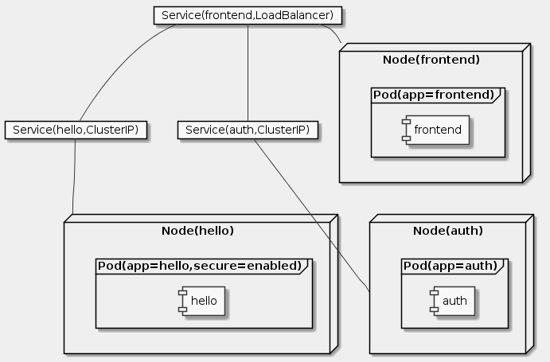

# Goal
- Provision a complete Kubernetes cluster using Kubernetes Engine
- Deploy and manage Docker containers using kubectl
- Break an application into microservices using Kubernetes' Deployments and Services

# Task
- [x] Get the sample code
- [x] Quick Kubernetes Demo
- [x] Pods
- [x] Creating Pods
- [x] Interacting with Pods
- [x] Services
- [x] Creating a Service
- [x] Adding Labels to Pods
- [x] Deploying Applications with Kubernetes
- [x] Creating Deployments

# Supplement

```uml
skinparam monochrome true
skinparam backgroundColor #EEEEFF

card "Service(frontend,LoadBalancer)" as S1
card "Service(hello,ClusterIP)" as S2
card "Service(auth,ClusterIP)" as S3

node Node(frontend) as N1 {
  frame Pod(app=frontend) {
    component frontend
  }
}
node Node(hello) as N2 {
  frame Pod(app=hello,secure=enabled) {
    component hello
  }
}
node Node(auth) as N3 {
  frame Pod(app=auth) {
    component auth
  }
}

S1 -- S2
S1 -- S3

S1 -- N1
S2 -- N2
S3 -- N3
```

## Get the sample code
```sh
gcloud config set compute/zone us-central1-b
gcloud container clusters create io

git clone https://github.com/googlecodelabs/orchestrate-with-kubernetes.git
cd orchestrate-with-kubernetes/kubernetes
ls
```

## Quick Kubernetes Demo
```sh
kubectl create deployment nginx --image=nginx:1.10.0
kubectl get pods
kubectl expose deployment nginx --port 80 --type LoadBalancer
kubectl get services
curl http://35.184.180.94:80
```

## Pods
https://kubernetes.io/docs/concepts/workloads/pods/pod/
https://kubernetes.io/docs/concepts/storage/volumes/

## Creating Pods
https://github.com/kelseyhightower/app

```sh
cat pods/monolith.yaml
kubectl create -f pods/monolith.yaml
kubectl get pods
kubectl describe pods monolith
```

## Interacting with Pods
```sh
kubectl port-forward monolith 10080:80
```
```sh
curl http://127.0.0.1:10080
curl http://127.0.0.1:10080/secure
curl -u user http://127.0.0.1:10080/login
TOKEN=$(curl http://127.0.0.1:10080/login -u user|jq -r '.token')
curl -H "Authorization: Bearer $TOKEN" http://127.0.0.1:10080/secure
kubectl logs monolith
```
```sh
kubectl logs -f monolith
```
```sh
curl http://127.0.0.1:10080
kubectl exec monolith --stdin --tty -c monolith /bin/sh
k8s> ping -c 3 google.com
k8s> exit
```

## Services
https://kubernetes.io/docs/concepts/services-networking/service/

## Creating a Service
```sh
cd ~/orchestrate-with-kubernetes/kubernetes
cat pods/secure-monolith.yaml
kubectl create secret generic tls-certs --from-file tls/
kubectl create configmap nginx-proxy-conf --from-file nginx/proxy.conf
kubectl create -f pods/secure-monolith.yaml
cat services/monolith.yaml
kubectl create -f services/monolith.yaml
gcloud compute firewall-rules create allow-monolith-nodeport --allow=tcp:31000
gcloud compute instances list
curl -k https://34.69.85.171:31000
kubectl get services monolith
kubectl describe services monolith
```

## Adding Labels to Pods
```sh
kubectl get pods -l "app=monolith"
kubectl get pods -l "app=monolith,secure=enabled"
kubectl label pods secure-monolith 'secure=enabled'
kubectl get pods secure-monolith --show-labels
kubectl describe services monolith | grep Endpoints
gcloud compute instances list
curl -k https://34.69.85.171:31000
```

## Deploying Applications with Kubernetes
https://kubernetes.io/docs/concepts/workloads/controllers/deployment/#what-is-a-deployment

## Creating Deployments
```sh
cat deployments/auth.yaml
kubectl create -f deployments/auth.yaml
kubectl create -f services/auth.yaml
kubectl create -f deployments/hello.yaml
kubectl create -f services/hello.yaml
kubectl create configmap nginx-frontend-conf --from-file=nginx/frontend.conf
kubectl create -f deployments/frontend.yaml
kubectl create -f services/frontend.yaml
kubectl get services frontend
curl -k https://35.184.162.151
```
