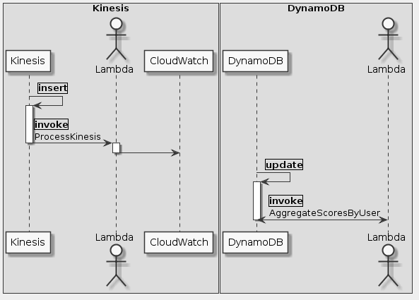

# Goal
- Create an AWS Lambda function from a blueprint
- Create an Amazon Kinesis Stream
- Use Amazon CloudWatch to monitor Kinesis event data triggering your Lambda function
- Create an Amazon DynamoDB table and insert items
- Enable the Amazon DynamoDB Streams feature
- Configure and troubleshoot Lambda functions

# Task
- [x] Overview
- [x] Start Lab
- [x] About the Technologies
- [x] Part 1: Event-Driven Programming with Amazon Kinesis and AWS Lambda
- [x] Task 1: Create an Amazon Kinesis Stream
- [x] Task 2: Create a Lambda Function
- [x] Task 3: Test your Function
- [x] Part 2: Event Driven Programing with Amazon DynamoDB and AWS Lambda
- [x] Task 4: Create Tables in DynamoDB
- [x] Task 5: Create a Lambda Function
- [x] Conclusion

# Supplement


```uml
skinparam monochrome true
skinparam backgroundColor #EEEEFF

box Kinesis
    participant Kinesis as K
    actor Lambda as LK
    participant CloudWatch as CW
end box

box DynamoDB
    participant DynamoDB as D
    actor Lambda as LD
end box

K -> K: |insert|
activate K
K -> LK: |invoke|\nProcessKinesis
deactivate K
activate LK
LK -> CW
deactivate LK

D -> D: |update|
activate D
D <-> LD: |invoke|\nAggregateScoresByUser
deactivate D
```

## Task 2: Create a Lambda Function
**kinesis-process-record-python**
```python
from __future__ import print_function

import base64
import json

print('Loading function')


def lambda_handler(event, context):
    #print("Received event: " + json.dumps(event, indent=2))
    for record in event['Records']:
        # Kinesis data is base64 encoded so decode here
        payload = base64.b64decode(record['kinesis']['data'])
        print("Decoded payload: " + payload)
    return 'Successfully processed {} records.'.format(len(event['Records']))
```
**LambdaBasicExecutionPolicy**
```json
{
    "Version": "2012-10-17",
    "Statement": [
        {
            "Action": [
                "logs:CreateLogGroup",
                "logs:CreateLogStream",
                "logs:PutLogEvents",
                "kinesis:GetRecords",
                "kinesis:GetShardIterator",
                "kinesis:DescribeStream",
                "kinesis:ListStreams"
            ],
            "Resource": [
                "*"
            ],
            "Effect": "Allow"
        }
    ]
}
```

## Task 3: Test your Function
**test**
```json
{
  "Records": [
    {
      "kinesis": {
        "partitionKey": "partitionKey-03",
        "kinesisSchemaVersion": "1.0",
        "data": "SGVsbG8sIHRoaXMgaXMgYSB0ZXN0IDEyMy4=",
        "sequenceNumber": "49545115243490985018280067714973144582180062593244200961",
        "approximateArrivalTimestamp": 1428537600
      },
      "eventSource": "aws:kinesis",
      "eventID": "shardId-000000000000:49545115243490985018280067714973144582180062593244200961",
      "invokeIdentityArn": "arn:aws:iam::EXAMPLE",
      "eventVersion": "1.0",
      "eventName": "aws:kinesis:record",
      "eventSourceARN": "arn:aws:kinesis:EXAMPLE",
      "awsRegion": "us-west-2"
    }
  ]
}
```

## Task 5: Create a Lambda Function
**LambdaBasicExecutionDynamoDBPolicy**
```json
{
    "Version": "2012-10-17",
    "Statement": [
        {
            "Action": [
                "dynamodb:GetRecords",
                "dynamodb:GetShardIterator",
                "dynamodb:DescribeStream",
                "dynamodb:ListStreams",
                "logs:CreateLogGroup",
                "logs:CreateLogStream",
                "logs:PutLogEvents",
                "lambda:InvokeFunction",
                "dynamodb:UpdateItem"
            ],
            "Resource": "*",
            "Effect": "Allow"
        }
    ]
}
```

```js
// Set up AWS client
var AWS = require('aws-sdk');
var dynamodb = new AWS.DynamoDB();

// update AWS configuration to set region
AWS.config.update({region : 'us-west-2'});

exports.handler = function(event, context) {
    // Keep track of how many requests are in flight
    var inflightRequests = 0;

    event.Records.forEach(function(record) {
        console.log('DynamoDB Record: %j', record.dynamodb);
        // Get the new image of the DynamoDB Streams record
        var newItemImage = record.dynamodb.NewImage;

        // Set the appropriate parameters for UpdateItem
        // Refer to the ADD operation in the UpdateItem API for UpdateExpression
        // http://docs.aws.amazon.com/amazondynamodb/latest/APIReference/API_UpdateItem.html
        // Adds the specified value to the item, if attribute does not exist, set the attribute
        var updateItemParams = {
            TableName: "GameScoresByUser",
            Key : { Username : newItemImage.Username },
            UpdateExpression : 'ADD Score :attrValue',
            ExpressionAttributeValues : {':attrValue' : newItemImage.Score}
        }

        // Make a callback function to execute once UpdateItem request completes
        // It may be helpful to refer to the updateItem method for the Javascript SDK
        // http://docs.aws.amazon.com/AWSJavaScriptSDK/latest/AWS/DynamoDB.html\#updateItem-property
        var updateItemCallback = function(err, data) {
            if (err) {
                // log errors
                console.log(err, err.stack);
            } else {
                // check if all requests are finished, if so, end the function
                inflightRequests--;
                if (inflightRequests === 0) {
                    context.succeed("Successfully processed " + event.Records.length + " records.");
                }
            }
        };

        // Send UpdateItem request to DynamoDB
        dynamodb.updateItem(updateItemParams, updateItemCallback);
        // Increase count for number of requests in flight
        inflightRequests++;
        });

        // If there are no more requests pending, end the function
        if (inflightRequests === 0) {
            context.succeed("Successfully processed " + event.Records.length + " records.");
        }
    };
```

**Test**
```json
{
  "Records": [
    {
      "eventID": "1",
      "eventVersion": "1.0",
      "dynamodb": {
        "Keys": { "RecordID": {"S": "2" }
      },
      "NewImage": {
        "RecordID": {"S": "2" },
        "Username": { "S": "Jane Doe" },
        "Score": { "N": "100" },
        "Nickname": { "S": "JaneD" }
      },
      "StreamViewType": "NEW_IMAGE",
      "SequenceNumber": "111",
      "SizeBytes": 26
    },
    "awsRegion": "us-west-2",
    "eventName": "INSERT",
    "eventSourceARN": "arn:aws:dynamodb:us-west-2:account-id:table/GameScoreRecords/stream/2015-10-07T00:48:05.899",
    "eventSource": "aws:dynamodb"
    }
  ]
}
```

**Insert record to GameScoreRecords**
```json
{
  "RecordID": 1,
  "Username": "John",
  "Score": 20
}
```

## Reference
- https://aws.amazon.com/documentation/lambda/
- https://aws.amazon.com/lambda/pricing/
- https://aws.amazon.com/documentation/dynamodb/
- http://aws.amazon.com/documentation/kinesis/
