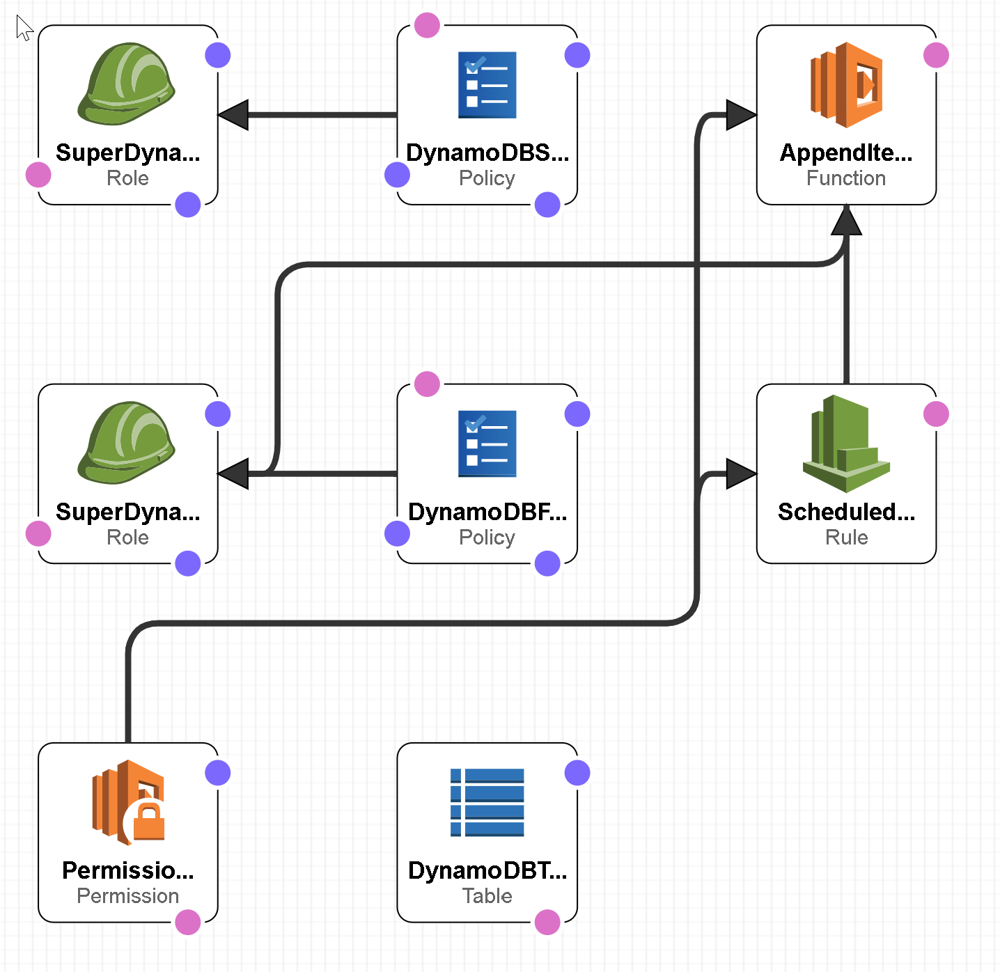

# Goal
- Create Lambda functions that retrieve data in a DynamoDB table in two different ways
- Test Lambda functions with a template
- Configure custom tests for Lambda functions

# Task
- [x] Check CloudFormation Status
- [x] Create Your Lambda Functions

# Supplement
## CloudFormation


```yaml
AWSTemplateFormatVersion: '2010-09-09'
Description: 'AWS CloudFormation Template for ScheduledFlightsDemo: Builds DynamoDB
  tables, an S3 bucket, and Lambda functions for use in a real-time voting application.
  ** This template creates multiple AWS resources. You will be billed for the AWS
  resources used if you create a stack from this template.'
Parameters:
  SuperMissionTableRead:
    Description: Read capacity units for ScheduledFlightsDemo DynamoDB table
    Type: String
    MinLength: '1'
    MaxLength: '6'
    AllowedPattern: '[0-9]*'
    Default: '1'
  SuperMissionTableWrite:
    Description: Write capacity units for ScheduledFlightsDemo DynamoDB table
    Type: String
    MinLength: '1'
    MaxLength: '6'
    AllowedPattern: '[0-9]*'
    Default: '1'

Resources:
  DynamoDBTable:
    Type: AWS::DynamoDB::Table
    Properties:
      AttributeDefinitions:
        - AttributeName: SuperHero
          AttributeType: S
        - AttributeName: MissionStatus
          AttributeType: S
        - AttributeName: Villain1
          AttributeType: S
        - AttributeName: Villain2
          AttributeType: S
        - AttributeName: Villain3
          AttributeType: S
        - AttributeName: SecretIdentity
          AttributeType: S
      KeySchema:
        - AttributeName: SuperHero
          KeyType: HASH
        - AttributeName: MissionStatus
          KeyType: RANGE
      ProvisionedThroughput:
        ReadCapacityUnits: !Ref 'SuperMissionTableRead'
        WriteCapacityUnits: !Ref 'SuperMissionTableWrite'
      StreamSpecification:
        StreamViewType: NEW_AND_OLD_IMAGES
      TableName: SuperMission
      GlobalSecondaryIndexes:
        - IndexName: myGSI
          KeySchema:
            - AttributeName: MissionStatus
              KeyType: HASH
            - AttributeName: Villain1
              KeyType: RANGE
          Projection:
            NonKeyAttributes:
              - SuperHero
              - SecretIdentity
            ProjectionType: INCLUDE
          ProvisionedThroughput:
            ReadCapacityUnits: '6'
            WriteCapacityUnits: '6'
        - IndexName: myGSI2
          KeySchema:
            - AttributeName: SecretIdentity
              KeyType: HASH
            - AttributeName: Villain3
              KeyType: RANGE
          Projection:
            NonKeyAttributes:
              - SuperHero
              - Villain1
            ProjectionType: INCLUDE
          ProvisionedThroughput:
            ReadCapacityUnits: '6'
            WriteCapacityUnits: '6'
      LocalSecondaryIndexes:
        - IndexName: myLSI
          KeySchema:
            - AttributeName: SuperHero
              KeyType: HASH
            - AttributeName: Villain2
              KeyType: RANGE
          Projection:
            NonKeyAttributes:
              - Villain1
              - MissionStatus
            ProjectionType: INCLUDE
  AppendItemToListFunction:
    Type: AWS::Lambda::Function
    Properties:
      FunctionName: AppendItemToListFunction
      Handler: lambdafunc.handler
      Role: !GetAtt 'SuperDynamoDBScanRole.Arn'
      Code:
        S3Bucket: us-east-1-aws-training
        S3Key: awsu-spl/spl133-dynamodb-webapp-part2/static/lambdafunc.zip
      Runtime: nodejs8.10
  SuperDynamoDBScanRole:
    Type: AWS::IAM::Role
    Properties:
      RoleName: SuperDynamoDBScanRole
      AssumeRolePolicyDocument:
        Version: '2012-10-17'
        Statement:
          - Effect: Allow
            Principal:
              Service: lambda.amazonaws.com
            Action: sts:AssumeRole
  DynamoDBFullRolePolicies:
    Type: AWS::IAM::Policy
    Properties:
      PolicyName: SuperDynamoDBScanPolicy
      PolicyDocument:
        Version: '2012-10-17'
        Statement:
          - Effect: Allow
            Action:
              - dynamodb:Query
              - dynamodb:Scan
              - s3:GetObject
              - s3:PutObject
              - dynamodb:BatchWriteItem
              - dynamodb:*
            Resource:
              - '*'
      Roles:
        - !Ref 'SuperDynamoDBScanRole'
  SuperDynamoDBQueryRole:
    Type: AWS::IAM::Role
    Properties:
      RoleName: SuperDynamoDBQueryRole
      AssumeRolePolicyDocument:
        Version: '2012-10-17'
        Statement:
          - Effect: Allow
            Principal:
              Service: lambda.amazonaws.com
            Action: sts:AssumeRole
  DynamoDBSelectedRolePolicies:
    Type: AWS::IAM::Policy
    Properties:
      PolicyName: SuperDynamoDBQueryPolicy
      PolicyDocument:
        Version: '2012-10-17'
        Statement:
          - Effect: Allow
            Action:
              - dynamodb:Query
            Resource: '*'
      Roles:
        - !Ref 'SuperDynamoDBQueryRole'
  ScheduledRule:
    Type: AWS::Events::Rule
    Properties:
      Description: ScheduledRule
      ScheduleExpression: rate(1 minute)
      State: ENABLED
      Targets:
        - Arn: !GetAtt 'AppendItemToListFunction.Arn'
          Id: TargetFunctionV1
  PermissionForEventsToInvokeLambda:
    Type: AWS::Lambda::Permission
    Properties:
      FunctionName: !Ref 'AppendItemToListFunction'
      Action: lambda:InvokeFunction
      Principal: events.amazonaws.com
      SourceArn: !GetAtt 'ScheduledRule.Arn'
```

## IAM
**SuperDynamoDBScanPolicy**
```json
{
    "Version": "2012-10-17",
    "Statement": [
        {
            "Action": [
                "dynamodb:Query",
                "dynamodb:Scan",
                "s3:GetObject",
                "s3:PutObject",
                "dynamodb:BatchWriteItem",
                "dynamodb:*"
            ],
            "Resource": [
                "*"
            ],
            "Effect": "Allow"
        }
    ]
}
```

**SuperDynamoDBQueryPolicy**
```json
{
    "Version": "2012-10-17",
    "Statement": [
        {
            "Action": [
                "dynamodb:Query"
            ],
            "Resource": "*",
            "Effect": "Allow"
        }
    ]
}
```

## AWS Lambda Function
**dynamo.scan()**
```js
var doc = require('aws-sdk');
var dynamo = new doc.DynamoDB();

exports.handler = function(event, context) {
    var getParams = {
        TableName:'SuperMission'
   };

    dynamo.scan(getParams, function(err, data){
        if (err) console.log(err, err.stack); // an error occurred
        else {
             context.succeed(data);
        }
    });
};
```

**dynamo.query()**
```js
var doc = require('aws-sdk');
var dynamo = new doc.DynamoDB();

exports.handler = function(event, context) {
        condition = {};
    condition["SuperHero"] = {
                ComparisonOperator: 'EQ',
                AttributeValueList:[{S: event.superhero}]
            }

    var getParams = {
        TableName:'SuperMission',
        ProjectionExpression:"SuperHero, MissionStatus, Villain1, Villain2, Villain3",
        KeyConditions: condition
   };

    dynamo.query(getParams, function(err, data){
        if (err) console.log(err, err.stack); // an error occurred
        else {
             context.succeed(data);
        }
    });
};
```
