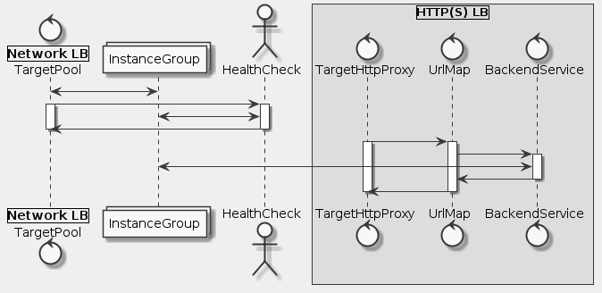

# Goal
- Setup a network load balancer.
- Setup a HTTP(s) load balancer.
- Get hands-on experience learning the differences between network load balancers and HTTP load balancers.

# Task
- [x] Create multiple web server instances
- [x] Create a Network Load Balancer
- [x] Create a HTTP(s) Load Balancer
- [x] Test your knowledge

# Supplement


```uml
skinparam monochrome true
skinparam backgroundColor #EEEEFF

control "|Network LB|\nTargetPool" as LB1
collections "InstanceGroup" as IG
actor "HealthCheck" as HC
box "|HTTP(S) LB|"
  control "TargetHttpProxy" as LB2
  control "UrlMap" as UM
  control "BackendService" as BS
end box

LB1 <-> IG

LB1 -> HC
activate LB1
activate HC
HC <-> IG
HC -> LB1
deactivate LB1
deactivate HC

LB2 -> UM
activate LB2
activate UM
UM -> BS
activate BS
BS <-> IG
BS -> UM
deactivate BS
UM -> LB2
deactivate UM
deactivate LB2
```

## Create multiple web server instances
```sh
gcloud config set compute/zone us-central1-a
gcloud config set compute/region us-central1
```

## Create a Network Load Balancer
```sh
cat <<EOF >startup.sh
#! /bin/bash
apt-get update
apt-get install -y nginx
service nginx start
sed -i -- 's/nginx/Google Cloud Platform - '"\$HOSTNAME"'/' /var/www/html/index.nginx-debian.html
EOF

gcloud compute instance-templates create nginx-template \
     --metadata-from-file startup-script=startup.sh
gcloud compute target-pools create nginx-pool
gcloud compute instance-groups managed create nginx-group \
     --base-instance-name nginx \
     --size 2 \
     --template nginx-template \
     --target-pool nginx-pool
gcloud compute instances list
gcloud compute firewall-rules create www-firewall --allow tcp:80
gcloud compute forwarding-rules create nginx-lb \
     --region us-central1 \
     --ports=80 \
     --target-pool nginx-pool
gcloud compute forwarding-rules list
```

## Create a HTTP(s) Load Balancer
```sh
gcloud compute http-health-checks create http-basic-check
gcloud compute instance-groups managed set-named-ports nginx-group \
   --named-ports http:80
gcloud compute backend-services create nginx-backend \
    --protocol HTTP \
    --http-health-checks http-basic-check \
    --global
gcloud compute backend-services add-backend nginx-backend \
    --instance-group nginx-group \
    --instance-group-zone us-central1-a \
    --global

gcloud compute url-maps create web-map \
    --default-service nginx-backend
gcloud compute target-http-proxies create http-lb-proxy \
    --url-map web-map
gcloud compute forwarding-rules create http-content-rule \
    --global \
    --target-http-proxy http-lb-proxy \
    --ports 80
gcloud compute forwarding-rules list
```

## Reference
- https://cloud.google.com/load-balancing/docs/network/
- https://cloud.google.com/load-balancing/docs/https/
- https://cloud.google.com/load-balancing/docs/backend-service
- https://cloud.google.com/compute/docs/reference/rest/v1/backendServices
- https://cloud.google.com/load-balancing/docs/health-checks
