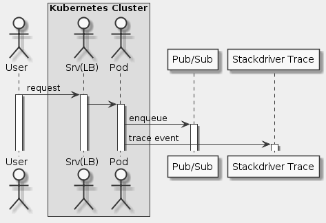

# Goal
- Tracing with Stackdriver on Kubernetes Engine

# Task
- [x] Overview
- [x] Architecture
- [x] Setup
- [x] Introduction to Terraform
- [x] Running Terraform
- [x] Initialization
- [x] Deployment
- [x] Create Stackdriver workspace
- [x] Deploy demo application
- [x] Validation
- [x] Troubleshooting in your own environment
- [x] Teardown

# Supplement


```uml
skinparam monochrome true
skinparam backgroundColor #EEEEFF

actor User as U
box "Kubernetes Cluster"
  actor "Srv(LB)" as S
  actor Pod as P
end box
participant "Pub/Sub" as PB
participant "Stackdriver Trace" as ST

U -> S: request
activate U
activate S
S -> P
activate P
P -> PB: enqueue
activate PB
P -> ST: trace event
activate ST
```

## Setup
```sh
git clone https://github.com/GoogleCloudPlatform/gke-tracing-demo
cd gke-tracing-demo
gcloud config set project qwiklabs-gcp-65ca0ce984374e97
gcloud config set compute/region us-central1
gcloud config set compute/zone us-central1-a
```

## Initialization
```sh
cd terraform
emacs provider.tf

terraform init
../scripts/generate-tfvars.sh
gcloud config list
```

## Deployment
```sh
terraform plan
terraform apply
```

## Deploy demo application
```sh
kubectl apply -f tracing-demo-deployment.yaml
echo http://$(kubectl get svc tracing-demo -n default -o jsonpath='{.status.loadBalancer.ingress[0].ip}')
```

## Validation
```sh
gcloud pubsub subscriptions pull --auto-ack --limit 10 tracing-demo-cli
```

## Troubleshooting in your own environment
```sh
kubectl get deployment tracing-demo
kubectl describe deployment tracing-demo
kubectl get pod
kubectl describe pod tracing-demo
kubectl logs tracing-demo-646d565656-pspb2
```

## Teardown
```sh
terraform destroy
```
