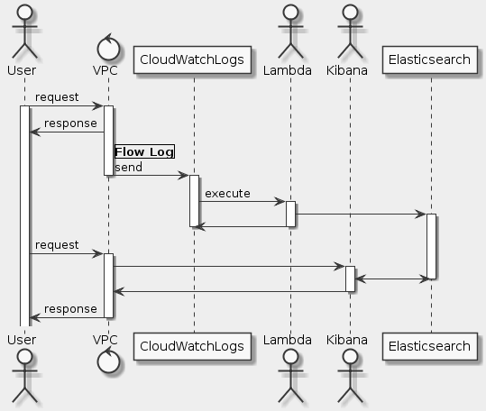

# Goal
- Amazon ES
- VPC Flow Logs
- Amazon CloudWatch Logs
- Kibana

# Task
- [x] Lab overview
- [x] Lab pre-requisites
- [x] Start Lab
- [x] Task 1: Create an Elasticsearch cluster
- [x] Task 2: Enable VPC Flow Logs
- [x] Task 3: Connect to the EC2 instance
- [x] Task 4: Verify resource provisioning
- [x] Task 5: Configure streaming to Amazon ES
- [x] Task 6: Format data in the Elasticsearch cluster
- [x] Task 7: Import dashboards and visualizations
- [x] End Lab
- [x] Conclusion
- [x] Additional resources

# Supplement


## Task 3: Connect to the EC2 instance
```
ssh -i .\qwikLABS-L2224-10895444.pem ec2-user@44.231.53.50
```

## Task 5: Configure streaming to Amazon ES
**AWS CloudWatch Logs Groups**

- Action: Stream to Amazon Elasticsearch Service

**AWS Lambda**

- Runtime: Python 3.7
- Environmental variables: |
    - ALLOWED_REGIONS: us-west-2
    - LAB_ID: karamo-test
    - MAX_INSTANCES: 1
    - STACK_ID: arn:aws:cloudformation:us-west-2:606428895882:stack/qls-10895444-267494a907e57c43-EC2EnforcerStack-16ESQCUSXDXJY/24271b80-2aa3-11ea-96c9-02a77ed54d64
    - TOPIC_ARN: arn:aws:sns:us-east-1:360097715036:Lab_Fraud_Prevention-EC2-Instances

```python
import boto3
import json
import os
from utils import *

allowed_regions = (os.getenv('ALLOWED_REGIONS') or '').split(',')

max_instances = int(os.getenv('MAX_INSTANCES') or '1')
stack_id = os.getenv('STACK_ID')
lab_id = os.getenv('LAB_ID') or 'unknown-lab'
topic_arn=os.getenv('TOPIC_ARN') or ''
sns_client=get_sns_client(topic_arn)

#print(f'allowed_regions={allowed_regions}, max_instances={max_instances}')

def num_non_terminated_instances(region):
   client=get_ec2_client(region)
   useful_states=['pending','running','shutting-down','stopping','stopped']
   max_results=100
   ans=client.describe_instances(
      Filters=[
         {'Name': 'instance-state-name', 'Values':useful_states}
      ],
      MaxResults=max_results
   )
   return sum(map(lambda r: len(r['Instances']), ans['Reservations']))

def get_instance_type(region: str, instance_id:str):
   client=get_ec2_client(region)
   return  client.describe_instance_attribute(InstanceId=instance_id, Attribute='instanceType')['InstanceType']['Value']

def num_all_non_terminated_instances(regions):
   return sum(map(lambda region: num_non_terminated_instances(region), regions))

def enforce_instance(instance_id, region, account):
   num_instances=num_all_non_terminated_instances(allowed_regions)
#   print(f'checking instance , instanceId=${instanceId}, region={region}, allowed_regions={allowed_regions}, num_instances={num_instances}')
   client_for_deleting=None
   action=None

   instance_type=get_instance_type(region,instance_id)                
   if region not in allowed_regions or num_instances > max_instances:
      client_for_deleting=get_ec2_client(region)
   if client_for_deleting:
      action="DELETE"
      try:
         client_for_deleting.modify_instance_attribute(InstanceId=instance_id,Attribute="disableApiTermination",Value='false')
         client_for_deleting.terminate_instances(InstanceIds= [instance_id]) 
      except Exception as e:
         action="DELETE failed"
         print(f'problem deleting instance - instance_id=${instance_id}, Exception: ${e}')
   else:
#      print('Allowing instance', instanceId, region)
      action="ALLOW"
   sns_publish_json(topic_arn, 
      {  'action':action, 
         'instance_id': instance_id,
         'num_instances': num_instances,
         'max_instances': max_instances,
         'region':region,
         'instance_type': instance_type,
         'account': account,
         'timestamp': get_timestamp(),
         'stack_id': stack_id,
         'lab_id' : lab_id
      }
   )
def handler(event, context):
#   print('event ...', event)
   region=event['region']
   instance_id=event['detail']['instance-id']
   account=event['account']
   enforce_instance(instance_id,region,account)
```

## Task 6: Format data in the Elasticsearch cluster
**Log data fromat**

```
version account-id interface-id srcaddr dstaddr srcport dstport protocol packets bytes start end action log-status
```

**Put data to Elasticsearch**

```sh
curl \
  --header "content-type: application/JSON" \
  -XPUT "https://search-flowlogs-2019-12-30-3-3az726nphd7lp5o3wtfliahkni.us-west-2.es.amazonaws.com/_template/template_1" \
  -d'
{
    "template":"cwl-*","mappings":{
        "FlowLogs": {
            "properties": {
                "interface_id": { "type": "keyword"},
                "srcaddr": { "type": "keyword"},
                "dstaddr": { "type": "keyword"}
            }
        }
    }
}'
```

## Task 7: Import dashboards and visualizations
```
https://search-flowlogs-2019-12-30-3-3az726nphd7lp5o3wtfliahkni.us-west-2.es.amazonaws.com/_plugin/kibana/
```

**Set up the dashboard object for VPC Flow Log**

```json
[
  {
    "_id": "SGDashboard",
    "_type": "dashboard",
    "_source": {
      "title": "SGDashboard",
      "hits": 0,
      "description": "",
      "panelsJSON": "[{\"col\":1,\"id\":\"ENIAction\",\"panelIndex\":3,\"row\":6,\"size_x\":3,\"size_y\":2,\"type\":\"visualization\"},{\"col\":10,\"id\":\"ENIdestports\",\"panelIndex\":4,\"row\":1,\"size_x\":3,\"size_y\":4,\"type\":\"visualization\"},{\"col\":1,\"id\":\"Eni-list\",\"panelIndex\":5,\"row\":1,\"size_x\":3,\"size_y\":3,\"type\":\"visualization\"},{\"col\":1,\"id\":\"EniProtocol\",\"panelIndex\":6,\"row\":4,\"size_x\":3,\"size_y\":2,\"type\":\"visualization\"},{\"col\":4,\"id\":\"enipi-all\",\"panelIndex\":7,\"row\":1,\"size_x\":6,\"size_y\":7,\"type\":\"visualization\"},{\"col\":1,\"columns\":[\"interface_id\",\"action\",\"srcaddr\",\"dstport\",\"bytes\",\"packets\"],\"id\":\"eni-search\",\"panelIndex\":8,\"row\":8,\"size_x\":12,\"size_y\":4,\"sort\":[\"@timestamp\",\"desc\"],\"type\":\"search\"}]",
      "optionsJSON": "{\"darkTheme\":false}",
      "uiStateJSON": "{\"P-2\":{\"vis\":{\"params\":{\"sort\":{\"columnIndex\":0,\"direction\":\"asc\"}}}},\"P-4\":{\"vis\":{\"params\":{\"sort\":{\"columnIndex\":null,\"direction\":null}}}},\"P-5\":{\"vis\":{\"params\":{\"sort\":{\"columnIndex\":null,\"direction\":null}}}}}",
      "version": 1,
      "timeRestore": false,
      "kibanaSavedObjectMeta": {
        "searchSourceJSON": "{\"filter\":[{\"$state\":{\"store\":\"appState\"},\"meta\":{\"alias\":null,\"disabled\":false,\"index\":\"cwl-*\",\"key\":\"action.keyword\",\"negate\":false,\"value\":\"ACCEPT\"},\"query\":{\"match\":{\"action.keyword\":{\"query\":\"ACCEPT\",\"type\":\"phrase\"}}}},{\"query\":{\"query_string\":{\"analyze_wildcard\":true,\"query\":\"*\"}}}]}"
      }
    }
  },
  {
    "_id": "eni-search",
    "_type": "search",
    "_source": {
      "title": "eni-search",
      "description": "",
      "hits": 0,
      "columns": [
        "interface_id",
        "action",
        "srcaddr",
        "dstport",
        "bytes",
        "packets"
      ],
      "sort": [
        "@timestamp",
        "desc"
      ],
      "version": 1,
      "kibanaSavedObjectMeta": {
        "searchSourceJSON": "{\"index\":\"d5bdcea0-889d-11e9-bfe1-fbda72ab40f5\",\"query\":{\"query\":{\"query_string\":{\"analyze_wildcard\":true,\"query\":\"*\"}},\"language\":\"lucene\"},\"filter\":[],\"highlight\":{\"pre_tags\":[\"@kibana-highlighted-field@\"],\"post_tags\":[\"@/kibana-highlighted-field@\"],\"fields\":{\"*\":{}},\"require_field_match\":false,\"fragment_size\":2147483647}}"
      }
    }
  },
  {
    "_id": "All",
    "_type": "search",
    "_source": {
      "title": "All",
      "description": "",
      "hits": 0,
      "columns": [
        "_source"
      ],
      "sort": [
        "@timestamp",
        "desc"
      ],
      "version": 1,
      "kibanaSavedObjectMeta": {
        "searchSourceJSON": "{\"index\":\"d5bdcea0-889d-11e9-bfe1-fbda72ab40f5\",\"query\":{\"query\":{\"query_string\":{\"analyze_wildcard\":true,\"query\":\"*\"}},\"language\":\"lucene\"},\"filter\":[],\"highlight\":{\"pre_tags\":[\"@kibana-highlighted-field@\"],\"post_tags\":[\"@/kibana-highlighted-field@\"],\"fields\":{\"*\":{}},\"require_field_match\":false,\"fragment_size\":2147483647}}"
      }
    }
  },
  {
    "_id": "ENIAction",
    "_type": "visualization",
    "_source": {
      "title": "ENIAction",
      "visState": "{\"title\":\"ENIAction\",\"type\":\"pie\",\"params\":{\"shareYAxis\":true,\"addTooltip\":true,\"addLegend\":true,\"legendPosition\":\"right\",\"isDonut\":false},\"aggs\":[{\"id\":\"1\",\"enabled\":true,\"type\":\"count\",\"schema\":\"metric\",\"params\":{}},{\"id\":\"2\",\"enabled\":true,\"type\":\"terms\",\"schema\":\"segment\",\"params\":{\"field\":\"action.keyword\",\"size\":5,\"order\":\"desc\",\"orderBy\":\"1\"}}],\"listeners\":{}}",
      "uiStateJSON": "{}",
      "description": "",
      "savedSearchId": "All",
      "version": 1,
      "kibanaSavedObjectMeta": {
        "searchSourceJSON": "{\"filter\":[]}"
      }
    }
  },
  {
    "_id": "enipi-all",
    "_type": "visualization",
    "_source": {
      "title": "enipi-all",
      "visState": "{\"title\":\"enipi-all\",\"type\":\"pie\",\"params\":{\"shareYAxis\":true,\"addTooltip\":true,\"addLegend\":true,\"legendPosition\":\"right\",\"isDonut\":false},\"aggs\":[{\"id\":\"1\",\"enabled\":true,\"type\":\"count\",\"schema\":\"metric\",\"params\":{}},{\"id\":\"2\",\"enabled\":true,\"type\":\"terms\",\"schema\":\"segment\",\"params\":{\"field\":\"srcaddr\",\"size\":200,\"order\":\"desc\",\"orderBy\":\"1\"}},{\"id\":\"3\",\"enabled\":true,\"type\":\"terms\",\"schema\":\"segment\",\"params\":{\"field\":\"protocol\",\"size\":5,\"order\":\"desc\",\"orderBy\":\"1\"}},{\"id\":\"4\",\"enabled\":true,\"type\":\"terms\",\"schema\":\"segment\",\"params\":{\"field\":\"dstport\",\"size\":200,\"order\":\"desc\",\"orderBy\":\"1\"}},{\"id\":\"5\",\"enabled\":true,\"type\":\"terms\",\"schema\":\"segment\",\"params\":{\"field\":\"dstaddr\",\"size\":200,\"order\":\"desc\",\"orderBy\":\"1\"}},{\"id\":\"6\",\"enabled\":true,\"type\":\"terms\",\"schema\":\"segment\",\"params\":{\"field\":\"srcport\",\"size\":200,\"order\":\"desc\",\"orderBy\":\"1\"}}],\"listeners\":{}}",
      "uiStateJSON": "{}",
      "description": "",
      "savedSearchId": "All",
      "version": 1,
      "kibanaSavedObjectMeta": {
        "searchSourceJSON": "{\"filter\":[]}"
      }
    }
  },
  {
    "_id": "EniProtocol",
    "_type": "visualization",
    "_source": {
      "title": "EniProtocol",
      "visState": "{\"title\":\"EniProtocol\",\"type\":\"pie\",\"params\":{\"shareYAxis\":true,\"addTooltip\":true,\"addLegend\":true,\"legendPosition\":\"right\",\"isDonut\":false},\"aggs\":[{\"id\":\"1\",\"enabled\":true,\"type\":\"count\",\"schema\":\"metric\",\"params\":{}},{\"id\":\"2\",\"enabled\":true,\"type\":\"terms\",\"schema\":\"segment\",\"params\":{\"field\":\"protocol\",\"size\":5,\"order\":\"desc\",\"orderBy\":\"1\"}}],\"listeners\":{}}",
      "uiStateJSON": "{}",
      "description": "",
      "savedSearchId": "All",
      "version": 1,
      "kibanaSavedObjectMeta": {
        "searchSourceJSON": "{\"filter\":[]}"
      }
    }
  },
  {
    "_id": "Eni-list",
    "_type": "visualization",
    "_source": {
      "title": "Eni-list",
      "visState": "{\"title\":\"Eni-list\",\"type\":\"table\",\"params\":{\"perPage\":10,\"showPartialRows\":false,\"sort\":{\"columnIndex\":null,\"direction\":null},\"showTotal\":false,\"totalFunc\":\"sum\",\"showMetricsAtAllLevels\":false},\"aggs\":[{\"id\":\"1\",\"enabled\":true,\"type\":\"count\",\"schema\":\"metric\",\"params\":{}},{\"id\":\"2\",\"enabled\":true,\"type\":\"terms\",\"schema\":\"bucket\",\"params\":{\"field\":\"interface_id\",\"size\":20000,\"order\":\"desc\",\"orderBy\":\"1\",\"otherBucket\":false,\"otherBucketLabel\":\"Other\",\"missingBucket\":false,\"missingBucketLabel\":\"Missing\",\"customLabel\":\"Top 20000 Interface_id\"}},{\"id\":\"3\",\"enabled\":true,\"type\":\"terms\",\"schema\":\"bucket\",\"params\":{\"field\":\"bytes\",\"size\":1,\"order\":\"desc\",\"orderBy\":\"1\",\"otherBucket\":false,\"otherBucketLabel\":\"Other\",\"missingBucket\":false,\"missingBucketLabel\":\"Missing\",\"customLabel\":\"Sum of bytes\"}}]}",
      "uiStateJSON": "{\"vis\":{\"params\":{\"sort\":{\"columnIndex\":null,\"direction\":null}}}}",
      "description": "",
      "savedSearchId": "All",
      "version": 1,
      "kibanaSavedObjectMeta": {
        "searchSourceJSON": "{\"filter\":[],\"query\":{\"query\":\"\",\"language\":\"lucene\"}}"
      }
    }
  },
  {
    "_id": "ENIdestports",
    "_type": "visualization",
    "_source": {
      "title": "ENIdestports",
      "visState": "{\"title\":\"ENIdestports\",\"type\":\"table\",\"params\":{\"perPage\":10,\"showPartialRows\":false,\"sort\":{\"columnIndex\":null,\"direction\":null},\"showTotal\":false,\"totalFunc\":\"sum\",\"showMetricsAtAllLevels\":false},\"aggs\":[{\"id\":\"1\",\"enabled\":true,\"type\":\"count\",\"schema\":\"metric\",\"params\":{}},{\"id\":\"2\",\"enabled\":true,\"type\":\"terms\",\"schema\":\"bucket\",\"params\":{\"field\":\"dstport\",\"size\":200,\"order\":\"desc\",\"orderBy\":\"1\",\"otherBucket\":false,\"otherBucketLabel\":\"Other\",\"missingBucket\":false,\"missingBucketLabel\":\"Missing\",\"customLabel\":\"Top 200 dstport\"}}]}",
      "uiStateJSON": "{\"vis\":{\"params\":{\"sort\":{\"columnIndex\":null,\"direction\":null}}}}",
      "description": "",
      "savedSearchId": "All",
      "version": 1,
      "kibanaSavedObjectMeta": {
        "searchSourceJSON": "{\"filter\":[],\"query\":{\"query\":\"\",\"language\":\"lucene\"}}"
      }
    }
  }
]
```

# References
- https://d0.awsstatic.com/whitepapers/Security/Networking_Security_Whitepaper.pdf
