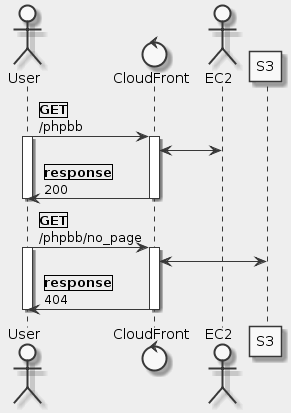

# Goal
- Create an Amazon CloudFront distribution using the AWS Management Console.
- Customize your Amazon CloudFront distribution.
- Log into your Dynamic Application.

# Task
- [x] Lab Overview
- [x] Start Lab
- [x] Task 1: Create an Amazon CloudFront Web Distribution
- [x] Task 2: Create a Custom Error Page
- [x] Task 3: Customize your Amazon CloudFront Web Distribution
- [x] Task 4: Configure the PHP Forum Website
- [x] Task 5: Use Your Website
- [x] End Lab
- [x] Additional Resources

# Supplement


## Task 1: Create an Amazon CloudFront Web Distribution
### Origin Domain Name**
ec2-100-21-183-191.us-west-2.compute.amazonaws.com/

### Default Cache Behavior Settings
**Viewer Protocol Policy**
HTTP and HTTPS

**Allowed HTTP Methods**
GET, HEAD, OPTIONS, PUT, POST, PATCH, DELETE

**Object Caching**
- Customize
    - Minimum TTL: 0
    - Forward Cookies: All

**Query String Fowarding and Caching**
Forward all, cache based on all

### Distribution Settings
**Price Class**
Use All Edge Locations

**Alternate Domain Names (CNAMEs)**
- Keep empty
- For example, if you want the URL for the object/images/image.jpg to look like http://www.example.com/images/image.jpg, you would create a CNAME for www.example.com.
    - With Amazon Route 53 you can configure your "zone apex" (root domain such as example.com without the www) to point to the same Amazon CloudFront distribution
    - https://docs.aws.amazon.com/Route53/latest/DeveloperGuide/routing-to-cloudfront-distribution.html
- You can create up to 10 CNAMEs per distribution

**SSL Certificate**
Default CloudFront Certificate (*.cloudfront.net)

**Defaut Root Object**
Keep empty

**Logging**
Off

**Distribution State**
Enable

## Task 2: Create a Custom Error Page
**Custom404ErrorPage.html**
```html
<html><body>
<h2>This is not the page you are looking for!</h2>
</body></html>
```

## Task 3: Customize your Amazon CloudFront Web Distribution
### Create Behavior 1
**Path Pattern**
`*.gif`

**Object Caching**
- Customize
    - Minimum TTL: 86400

### Create Origin
**Origin Domain Name**
qls-10919063-8bfa74b3c7ce6145-s3bucket-tigpheiaiod

**Restrict Bucket Access**
Yes

### Create Behavior 2
**Path Pattern**
`/Custom*ErrorPage.html`

**Origin or Origin Group**
qls-10919063-8bfa74b3c7ce6145-s3bucket-tigpheiaiod

### Create Custom Error Response
**HTTP Error Code**
404 Not Found

**Customize Error Response**
- Yes
    - Response Page Path: /Custom404ErrorPage.html
    - HTTP Response Code: 404 Not Found

## Task 4: Configure the PHP Forum Website
```
http://ec2-100-21-183-191.us-west-2.compute.amazonaws.com/phpbb
id: user
pw: bitnami
```
